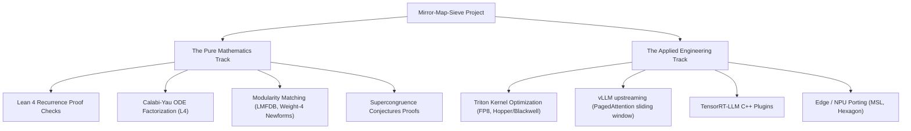

# Contributing to Mirror-Map-Sieve: A Call for Joined Community Efforts

We welcome mathematicians, AI hardware engineers, and open-source developers to collaborate on the **Mirror-Map-Sieve** project. 

Our laboratory bridges the gap between **computational number theory (Calabi–Yau geometry, modular forms)** and **highly optimized attention kernels (Triton, vLLM, TensorRT-LLM)**. We invite the global open-science community to join us on either of our two parallel research tracks.

---

## 🌌 Collaborative Contribution Tracks

---

## 1. 📐 The Pure Mathematics Track

We are seeking collaboration from specialists in Apéry-like sequences, modular forms, and algebraic geometry to tackle several critical open problems:

- **[Open Problem 1] Lean 4 Recurrence Certificate Verification:**
  - *Current Status:* The order-4, degree-13 Picard–Fuchs recurrence has been proven for all $n$ via Maxima's Zeilberger creative telescoping certificate.
  - *The Goal:* Translate and verify this certificate identity inside Lean 4 (`ring` / `linear_combination` paths) for absolute, machine-checked mathematical closure.
- **[Open Problem 2] Factorization of $L_6 = L_4 \cdot L_2$:**
  - *Current Status:* The indicial equation at $z=0$ shows an order-4 MUM block + an order-2 apparent singularity, implying $L_6$ factors over $\mathbb{Q}(z)$.
  - *The Goal:* Establish a reproducible symbolic factoring environment in SageMath using `ore_algebra` to isolate the irreducible Calabi–Yau $L_4$ operator.
- **[Open Problem 3] LMFDB Matching & Modularity:**
  - *Current Status:* Once $L_4$ is isolated, we need to extract conifold fibers and compute Frobenius traces $a_p$.
  - *The Goal:* Match $a_p$ against modular forms database (LMFDB) to identify the matching weight-4 newform and formulate Beukers-type supercongruences.
- **[Open Problem 4] Cubic Supercongruence Conjecture ($S(p-1) \equiv 1 \pmod{p^3}$):**
  - *Current Status:* Proved and Lean-verified for modulo $p$. Computational checks hold up to $p=200$ for modulo $p^3$.
  - *The Goal:* Develop a harmonic-sum or modular-form-based analytic proof for the $p^3$ congruence.

---

## 2. ⚡ The Applied AI Hardware Track

We invite CUDA engineers, deep learning compiler specialists, and performance engineers to co-develop and productize our high-performance attention layouts:

- **[Task 1] Fused Triton Kernel Optimizations:**
  - Extend our fused `learnable_alibi_triton.py` kernel to support **FP8 precision** and specialize register layouts for Hopper (H100/H200) and Blackwell (B200) architectures.
- **[Task 2] Upstream Integration into vLLM:**
  - Collaborate on implementing layer-wise sliding-window constraints inside vLLM’s `PagedAttention` block-memory manager, turning our **95.5% KV-cache reduction** into massive production concurrency gains.
- **[Task 3] TensorRT-LLM Custom Plugins:**
  - Port our Triton sliding-window execution into custom TRT-LLM C++ plugins, ensuring full compatibility with CUDA Graphs and sub-millisecond execution times.
- **[Task 4] Edge & NPU Deployment:**
  - Compile the pruned attention kernels to ONNX Runtime and port cache layouts to MLC-LLM, optimizing execution for local NPUs (Apple Metal, Qualcomm Hexagon).

---

## 🤝 How to Join & Contribute

1. **Explore the Codebase:**
   - Read the mathematics research program in `docs/RESEARCH_PLAN.md`.
   - Read our hardware-performance analysis in `docs/PHASE3_CYSIEVE_GPU_FINDINGS.md` and `h13_h9_experiments_report.md`.
2. **Review Open Issues:** 
   - Check the repository's GitHub Issues. We maintain specific tags: `math-research`, `cuda-triton`, `lean4`, and `vllm-integration`.
3. **Engage in Discussions:**
   - We encourage open discussion on design choices, mathematical conjectures, and kernel implementations. Participate via GitHub Discussions or open a draft PR to share ideas early.
4. **Pull Request Protocol:**
   - Create a feature branch: `git checkout -b feature/your-contribution`.
   - Ensure all Python tests pass: `pytest tests/`.
   - Ensure Lean 4 proofs compile cleanly without `sorry` before submitting math proofs.
   - Keep your commit messages clear, structured, and descriptive.
