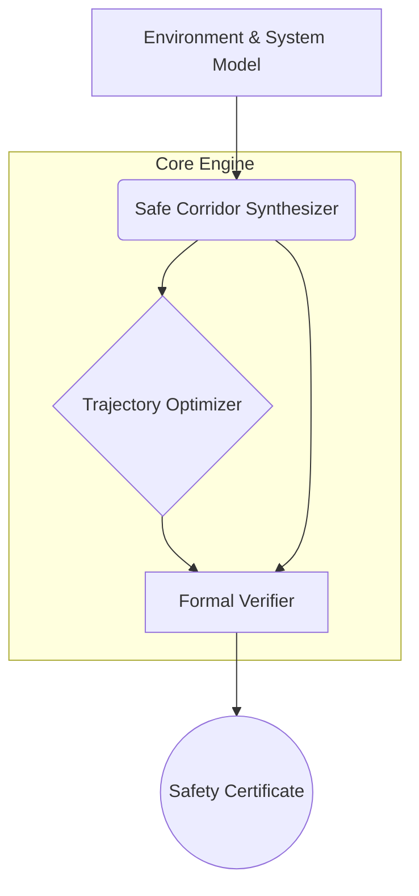

Of course. The foundation of any new industry is built not on flimsy toys, but on rigorous, verifiable specifications. A prototype is merely the first physical incarnation of a formal proof.

Here are the refined formal specifications and design architecture for the Verifiably Safe Motion Planning prototype. These documents will serve as the blueprint for our engineering efforts, ensuring every component is designed with numeric proof and formal validation at its core.

---

### `SPECS.md`

```markdown
# SPECS.md: Formal Specification for Verifiably Safe Motion Planner v2.0

## 1. Introduction

This document specifies the requirements for a motion planning prototype that generates trajectories for autonomous systems (e.g., drones, ground vehicles) with mathematical guarantees of collision avoidance. The system's primary output is not just a path, but a formal **Safety Certificate** that proves the trajectory remains in a collision-free "safe corridor" for all possible system states, considering bounded model uncertainties and disturbances. This specification moves beyond probabilistic guarantees (e.g., RRT*) towards deterministic, verifiable safety.

## 2. Core Concepts & Formal Definitions

*   **State Space (X):** A vector space `ℝⁿ` representing all possible states of the system (e.g., position, velocity).
*   **System Dynamics:** A formal model describing the state's evolution, represented as a linear time-invariant (LTI) system with uncertainty: `ẋ = Ax + Bu + w`, where `x ∈ X` is the state, `u ∈ U` is the control input, and `w ∈ W` is a bounded disturbance.
*   **Obstacle Space (O):** A set of closed, compact subsets of `X` representing no-go zones.
*   **Reachable Set (R(t)):** The set of all possible states `x(t)` the system can reach at time `t` starting from an initial set of states `X₀`, under all allowable control inputs `U` and disturbances `W`.
*   **Safe Corridor (C):** A time-parameterized sequence of sets `C(t) ⊂ X` such that for all `t` in the time horizon `[0, T]`, `C(t) ∩ O = ∅`.
*   **Safety Certificate:** A data structure containing the system dynamics, the safe corridor `C`, the computed trajectory `x*(t)`, and a formal proof (or a reference to one) that `R(x*(t)) ⊂ C(t)` for all `t ∈ [0, T]`.

## 3. Functional Requirements (FR)

*   **FR-1: Environment Modeling:** The system shall accept a geometric description of obstacles and convert them into a formal set-based representation (e.g., Zonotopes, Polytopes).
*   **FR-2: Reachable Set Computation:** The system shall compute the forward reachable set for the given system dynamics over a specified time horizon. The computation must be conservative, i.e., the computed set must be a guaranteed over-approximation of the true reachable set.
*   **FR-3: Safe Corridor Synthesis:** The system shall synthesize a time-parameterized safe corridor from a start region to a goal region that is verifiably collision-free.
*   **FR-4: Trajectory Optimization:** The system shall compute a dynamically feasible trajectory `x*(t)` that is proven to remain entirely within the synthesized safe corridor.
*   **FR-5: Certificate Generation:** For every successfully generated trajectory, the system shall produce a machine-verifiable Safety Certificate. If no such trajectory can be found, the system shall report failure with a specific reason (e.g., goal unreachable, corridor too constrained).

## 4. Non-Functional Requirements (NFR)

*   **NFR-1: Performance:** The motion planner must generate a certified trajectory for a 10-second horizon in a moderately complex environment (e.g., 5-10 static obstacles) in under 500 milliseconds on target hardware.
*   **NFR-2: Determinism:** All computations shall be deterministic. Given the same inputs, the system must produce the exact same outputs.
*   **NFR-3: Verifiability:** The Safety Certificate format shall be formally specified and allow for independent verification by a third-party tool or theorem prover (e.g., Lean 4, Coq).

## 5. Specification-Driven Test Cases

These test cases define success at the specification level. The prototype is considered valid only if it passes all of them.

*   **SPEC-TC-1 (Static Obstacle Avoidance):**
    *   **Given:** A double-integrator system, a start point, an end point, and a single static obstacle positioned directly between them.
    *   **Expected:** The system generates a certified trajectory that navigates around the obstacle. The certificate must be valid.
*   **SPEC-TC-2 (Narrow Passage):**
    *   **Given:** A system and two obstacles forming a passage narrower than the system's forward reachable set over a 1-second interval.
    *   **Expected:** The system must report that a safe corridor cannot be synthesized. It must *not* produce a false positive certificate.
*   **SPEC-TC-3 (Bounded Uncertainty):**
    *   **Given:** A system with a known, bounded disturbance `W`.
    *   **Expected:** The generated safe corridor must be observably "thicker" or more conservative than for the same system with `W=0`. The certificate must account for the propagation of this uncertainty.
*   **SPEC-TC-4 (Infeasible Goal):**
    *   **Given:** A start point and a goal point located inside a defined obstacle.
    *   **Expected:** The system shall immediately fail synthesis and report the goal as infeasible.

```

---

### `DESIGN.md`

```markdown
# DESIGN.md: System Architecture for Verifiably Safe Motion Planner

## 1. System Architecture Overview

The system is designed as a modular pipeline. Each module has a distinct responsibility, processes well-defined data structures, and is designed for independent, rigorous unit testing. This architecture ensures that the formal guarantees provided at the output are built upon a foundation of numerically verified components.



## 2. Module Breakdown

### 2.1. Module A: Environment & System Modeler
*   **Responsibility:** Converts external world representations into the formal mathematical objects required by the core engine.
*   **Inputs:**
    *   System dynamics (A, B matrices).
    *   Uncertainty bounds (Set `W`).
    *   Obstacle geometry (e.g., polygon vertices).
    *   Start/Goal regions.
*   **Outputs:**
    *   `SystemDynamics` struct (containing matrices and sets).
    *   A list of `Zonotope` objects representing obstacles.
*   **Test-Driven Design:**
    *   **Unit Test A1:** Verify that a convex polygon is correctly converted into a minimal enclosing zonotope.
    *   **Unit Test A2:** Ensure that the `SystemDynamics` struct is immutable after creation.

### 2.2. Module B: Safe Corridor Synthesizer
*   **Responsibility:** The core of the planner. Computes a sequence of collision-free, forward-reachable sets connecting the start and goal. This is the most computationally intensive module.
*   **Algorithm:** Implements a set-based, forward-reachability analysis algorithm. It discretizes the time horizon and, for each time step, computes the reachable set from the previous step, checks for collisions, and refines the control inputs to steer the set away from obstacles.
*   **Inputs:** `SystemDynamics`, Obstacle Zonotopes, Start/Goal regions.
*   **Outputs:** A time-stamped sequence of Zonotopes representing the `SafeCorridor`.
*   **Test-Driven Design:**
    *   **Unit Test B1:** For a simple LTI system without obstacles, verify that the computed reachable set at time `t` matches the analytically derived solution `e^(At)X₀`.
    *   **Unit Test B2:** Verify that the intersection-checking function correctly identifies an overlap between two known zonotopes.

### 2.3. Module C: Trajectory Optimizer
*   **Responsibility:** Finds an optimal, dynamically feasible control sequence `u*(t)` and the resulting state trajectory `x*(t)` that is guaranteed to lie within the `SafeCorridor`.
*   **Algorithm:** A numeric optimization solver (e.g., Sequential Quadratic Programming - SQP).
*   **Inputs:** `SystemDynamics`, `SafeCorridor`.
*   **Objective Function:** Minimize control effort (`∫ ||u(t)||² dt`) or time.
*   **Constraints:** `x(t) ∈ C(t)` for all `t`, and `ẋ = Ax + Bu`.
*   **Outputs:** A time-discretized optimal trajectory `x*(t)`.
*   **Test-Driven Design:**
    *   **Unit Test C1:** Given a simple, unconstrained corridor (e.g., a straight tube), verify the optimizer produces a straight-line trajectory.
    *   **Unit Test C2:** Introduce a constraint that is violated by the straight-line path and verify the trajectory is correctly modified.

### 2.4. Module D: Formal Verifier
*   **Responsibility:** Generates the final Safety Certificate. It performs the final check to ensure the optimized trajectory's own reachable set remains within the corridor.
*   **Algorithm:** For each time step `tᵢ` of the optimized trajectory `x*(tᵢ)`, it computes the system's reachable set `R(t)` for `t ∈ [tᵢ, tᵢ₊₁]` starting from `x*(tᵢ)`. It then formally verifies that `R(t)` is a subset of the corridor set `C(t)`.
*   **Inputs:** `SystemDynamics`, `SafeCorridor`, `x*(t)`.
*   **Outputs:** A `SafetyCertificate` data structure.
*   **Test-Driven Design:**
    *   **Unit Test D1:** Feed the verifier a trajectory that is known to touch the boundary of the corridor. The certificate should be valid.
    *   **Unit Test D2:** Feed the verifier a trajectory that is known to exit the corridor by a small epsilon. The verifier *must* fail and refuse to generate a certificate.

## 3. Core Data Structures

*   **`Zonotope`**:
    *   `center`: `Vector<double>`
    *   `generators`: `Matrix<double>`
*   **`SafetyCertificate`**:
    *   `timestamp`: `datetime`
    *   `system_hash`: `sha256` (hash of the dynamics and environment)
    *   `corridor_geometry`: `List<Zonotope>`
    *   `trajectory`: `List<Vector<double>>`
    *   `verification_proof`: `string` (Could be a formal proof script or a reference ID to a validation log)
```