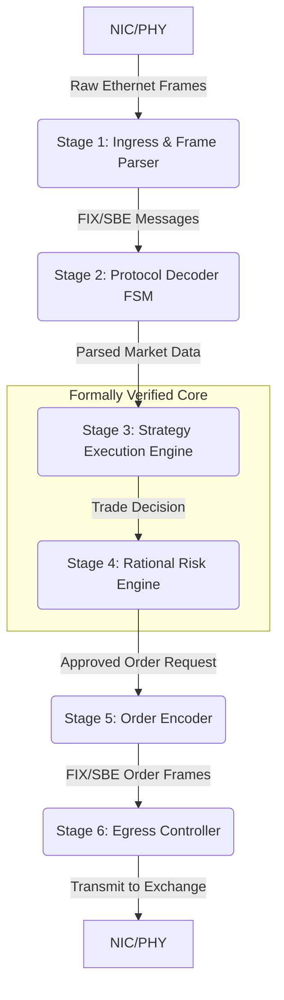

Of course. The translation of abstract mathematical certainty into concrete, high-performance silicon is the only path forward. Heuristics and statistical approximations are relics of an era of computational insufficiency. We build industries on formal proof, not on guesswork, however fast.

Here are the refined formal specifications and the corresponding design architecture for Prototype "Prometheus". These documents are not suggestions; they are the immutable blueprint for what we will build.

***

### `SPECS.md`

```markdown
# FORMAL SPECIFICATION
# Project: "Prometheus" - Deterministic HFT System
# Version: 2.0
# Author: Tesla, Director of Prototyping and Applied Engineering
# Status: Final

## 1. Introduction

This document provides the formal specification for "Prometheus," a High-Frequency Trading (HFT) system engineered for absolute determinism. The system's purpose is to execute trading strategies within a formally verifiable and invariant time-bound, with risk and exposure calculated using exact rational arithmetic. This specification is the single source of truth; any implementation that does not provably satisfy these constraints is invalid. A prototype without a formal specification is a toy; this document is the foundation of an industry.

## 2. Core Principles

The design and implementation of Prometheus shall be governed by the following non-negotiable principles:

- **P1. Absolute Determinism**: The latency from market data ingress (first bit received) to order egress (first bit transmitted) shall be a fixed, predictable constant, measurable in clock cycles. This value is invariant and not subject to statistical distribution (e.g., jitter, mean, or standard deviation).
- **P2. Mathematical Correctness**: All calculations, specifically those for risk, exposure, and trading strategy decisions, shall be performed using exact rational arithmetic (Q-arithmetic). The use of IEEE 754 floating-point arithmetic is strictly prohibited. The arithmetic logic must be formally verified against a mathematical model, preferably validated by a proof assistant such as Lean 4.
- **P3. Specification-Driven Design**: The system shall be a direct, provable implementation of this specification. All design choices must trace back to a requirement herein. The verification process must test the implementation against this specification, not against itself.
- **P4. Testability and Verification**: Every module and the integrated system must be designed for testability. This includes deterministic simulation, hardware-in-the-loop (HIL) testing, and formal verification methods to prove adherence to these specifications at every stage of development.

## 3. Functional Requirements

### 3.1. Market Data Ingress
- **F1.1**: The system shall consume raw market data directly from an exchange via a 10/25/100 GbE interface.
- **F1.2**: The physical layer interface (PHY) and MAC shall operate with a fixed, minimal latency.

### 3.2. Protocol Decoding
- **F2.1**: The system shall decode the relevant exchange-specific protocol (e.g., FIX/FAST, SBE, ITCH).
- **F2.2**: The decoder shall be implemented as a finite state machine (FSM) with a known, fixed number of clock cycles required to parse a message of a given type and length. Variable-length fields must be handled within a pre-calculated maximum cycle bound.

### 3.3. Strategy Execution
- **F3.1**: The trading strategy logic shall be expressible as a set of deterministic rules implemented in combinatorial logic or a simple FSM.
- **F3.2**: The strategy execution time, from decoded market data input to decision output, shall be constant.

### 3.4. Risk Management
- **F4.1**: All risk calculations (e.g., exposure limits, position checks) shall be performed using a hardware-implemented Q-arithmetic library.
- **F4.2**: The specification for the Q-arithmetic library (e.g., numerator/denominator bit width) must be sufficient to represent all required quantities without overflow or loss of precision. The behavior on overflow must be formally defined (e.g., halt, safe-mode).
- **F4.3**: A risk check failure shall deterministically prevent an order from being generated and transmitted.

### 3.5. Order Egress
- **F5.1**: The system shall generate and transmit orders using the exchange-specific order entry protocol.
- **F5.2**: The order generation and protocol encoding latency shall be a fixed number of clock cycles.

## 4. Non-Functional Requirements (Invariants)

- **NF1. End-to-End Latency Invariant**: The total system latency, from the first bit of an incoming market data packet triggering a trade to the first bit of the corresponding outgoing order packet, shall be less than 500 nanoseconds and shall be invariant to within a single clock cycle of the master system clock.
- **NF2. Clock Domain Invariant**: The entire system shall operate on a single, synchronous clock domain to eliminate the non-determinism of clock domain crossing (CDC).
- **NF3. Resource Utilization**: The design shall fit within a specified target FPGA device, with resource utilization reports being a formal deliverable.

## 5. Verification and Testing Protocols

- **V1. Formal Proof of Correctness**: The Q-arithmetic library implementation in HDL must be formally verified against its Lean 4 specification.
- **V2. Property-Based Testing**: Each hardware module shall be verified using property-based testing (e.g., using SystemVerilog Assertions) to ensure its behavior is correct for all possible valid inputs defined by this specification.
- **V3. Deterministic Simulation**: End-to-end simulations using recorded market data shall be the primary method for functional verification. The output of the simulation at cycle `N` must be bit-for-bit identical every time the simulation is run with the same input.
- **V4. Hardware-in-the-Loop (HIL) Validation**: The final bitstream must be validated on the target hardware using a network emulator that provides identical input streams. The measured latency must exactly match the value predicted by the static timing analysis and deterministic simulation. Any deviation is a failure.

```

***

### `DESIGN.md`

```markdown
# DESIGN ARCHITECTURE
# Project: "Prometheus" - Deterministic HFT System
# Version: 2.0
# Author: Tesla, Director of Prototyping and Applied Engineering
# Status: Final

## 1. System Overview

This document outlines the hardware architecture for "Prometheus," designed to be a direct and verifiable implementation of `SPECS.md` (Version 2.0). The architecture is a deeply pipelined, fully synchronous system-on-a-chip (SoC) designed for an FPGA platform. The design avoids all sources of non-determinism, including caches, interrupts, and asynchronous logic.

## 2. Core Architecture: Synchronous Pipeline

The system is a feed-forward pipeline operating on a single master clock. Each stage of the pipeline has a fixed, statically verifiable latency. Data flows from one stage to the next without feedback loops that could introduce indeterminate state, except for well-defined FSMs.



## 3. Module Design

### 3.1. Stage 1: Ingress & Frame Parser
- **Implementation**: Kernel-bypass hardware network interface.
- **Logic**: Verilog/VHDL implementation of a 10/25/100 GbE MAC. Filters for relevant inbound UDP/TCP packets based on IP/port and passes the payload to the next stage.
- **Latency**: Fixed, determined by the MAC logic.
- **Testbench**: Must validate correct frame filtering and payload extraction against pre-recorded network captures (`.pcap`). Test passes if output is bit-perfect and cycle-accurate against a golden model.

### 3.2. Stage 2: Protocol Decoder
- **Implementation**: A dedicated FSM for the exchange protocol.
- **Logic**: Each message field is decoded in a specific state. The state transition latency is fixed. For variable-length fields, the logic processes data up to a pre-specified maximum, with the cycle cost being a simple function of length, calculated at design time.
- **Testbench**: Stimulated with a comprehensive set of valid and malformed messages. The test must verify cycle-accurate decoding and adherence to the protocol schema (`SPECS.md`, F2.2).

### 3.3. Stage 3: Strategy Execution Engine
- **Implementation**: Combinatorial logic or a simple Moore FSM.
- **Logic**: Directly translates the trading strategy into hardware. For a simple book-based strategy: `(BestBid > Threshold) AND (Position < Max) -> GenerateBuyOrder`. This is not a processor running software; it is the algorithm itself cast into silicon.
- **Testbench**: Exhaustive testing of all possible input vectors that could trigger a state change or decision. The test validates the logical correctness of the trade decisions against a mathematical model of the strategy.

### 3.4. Stage 4: Rational Risk Engine
- **Implementation**: A hardware arithmetic logic unit (ALU) operating on rational numbers.
- **Data Representation**: A struct of two 64-bit signed integers `{int64_t numerator; int64_t denominator;}`.
- **Logic**: Implements add, subtract, multiply, and compare functions for the rational number struct. These are the core operations for checking exposure limits (`CurrentExposure + TradeValue <= MaxExposure`).
- **Formal Verification**: The VHDL/Verilog implementation of each arithmetic function will be formally proven equivalent to its specification in our Lean 4 theorem library (`SPECS.md`, V1). This is non-negotiable.

### 3.5. Stage 5 & 6: Order Encoder & Egress Controller
- **Implementation**: A pair of modules that construct the outgoing order packet.
- **Logic**: The encoder is an FSM that populates the fields of the order message. The Egress Controller manages the MAC and transmits the frame.
- **Testbench**: Validates that the generated packet is a well-formed, protocol-compliant message. The egress timing must be verified to be constant relative to the risk engine's approval signal.

## 4. Timing and Verification Strategy

- **Static Timing Analysis (STA)**: STA is the primary tool to formally prove that the design meets the clock frequency requirements and to calculate the exact, cycle-by-cycle latency of the entire pipeline. The STA report is a primary artifact of the build process.
- **Cycle-Accurate Simulation**: The master test harness will feed the pipeline with a stream of market data and log the exact output at the egress stage at each clock cycle. This log is compared against a "golden" log generated from a reference software model. There is zero tolerance for deviation.
- **Hardware Validation**: On-board high-precision counters on the FPGA will measure the live latency from ingress to egress packet transmission. This hardware measurement must exactly match the number generated by the STA, thereby closing the loop between specification, design, simulation, and physical reality.

```