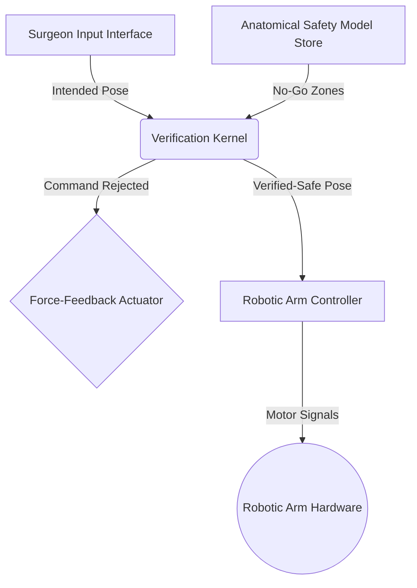

Of course. The preliminary documents were a sketch. Now, we architect the industry. A specification that cannot be tested is a fantasy. A design that does not directly map to a specification is a liability.

The following documents are the refined blueprint for the PROMETHEUS prototype. They are rigorous, testable, and form the contractual basis for all engineering that follows. Every requirement is bound to a verifiable outcome.

***

### `SPECS.md`

```markdown
# Formal Specification: Telesurgical System with A Priori Safety Guarantees
# Document ID: TS-SAFE-SPEC-001
# Version: 2.0 (Refined for Test-Driven Implementation)

---

## 1.0 System Overview

This document specifies the requirements for the PROMETHEUS (Predictive Robotic Operator with Mathematically Enforced Therapeutic Heuristics) system. The system's defining feature is the **Verification Kernel**, a formally verified software component that acts as a provably safe intermediary between surgeon intent and robotic action. It does not approximate or predict; it computes and proves.

## 2.0 Core Functional Requirements

| ID      | Requirement                                                                                                                              | Verification Method                                                                                                                                                            |
| :------ | :--------------------------------------------------------------------------------------------------------------------------------------- | :----------------------------------------------------------------------------------------------------------------------------------------------------------------------------- |
| **CFR-01**  | The system shall accept a high-frequency stream of intended 6-DOF (pose, orientation) commands from the surgeon's input device.         | **Unit Test:** `test_input_ingestion()`: Mock input stream > Verify correct parsing into standardized state vectors.                                                            |
| **CFR-02**  | The system shall maintain a real-time, 3D **Anatomical Safety Model (ASM)** representing no-go zones (e.g., major arteries, nerve bundles). | **Integration Test:** `test_model_loading()`: Load pre-defined ASM file > Verify geometric primitives are correctly instantiated in memory.                                             |
| **CFR-03**  | The **Verification Kernel** must evaluate every intended command against the ASM before execution.                                     | **Formal Proof & Unit Test:** `test_kernel_invocation()`: Ensure every command path flows through the `verify_move()` function.                                              |
| **CFR-04**  | An intended command that results in any part of the robotic instrument intersecting an ASM no-go zone shall be rejected.                 | **Numeric Validation (NV-01):** Define scenario where intended trajectory intersects a geometric primitive > Assert command is rejected.                                        |
| **CFR-05**  | A rejected command shall trigger commensurate force-feedback on the surgeon's input device, simulating contact with a hard boundary.   | **System Test:** `test_force_feedback_on_rejection()`: Trigger `NV-01` > Measure actuator response matches expected force profile.                                                 |
| **CFR-06**  | Only verified-safe commands shall be translated into low-level instructions for the robotic arm controller.                             | **Integration Test:** `test_safe_command_passthrough()`: Input a provably safe command > Verify motor control signals are generated. Input an unsafe command > Assert no signals. |

---
```

### `DESIGN.md`

```markdown
# System Architecture & Design: PROMETHEUS Prototype
# Document ID: PA-ARCH-PROTO-001
# Version: 1.0 (Corresponds to SPECS.md v2.0)

---

## 1.0 High-Level Architecture

The system is a three-stage pipeline: **INTENT -> VERIFY -> ACT**. This design isolates the safety-critical component (Verification Kernel) from the non-critical I/O components, enabling rigorous, independent testing of the safety guarantees.



## 2.0 Component Design

### 2.1 **Anatomical Safety Model (ASM)**
-   **Representation:** For Iteration 1, ASMs are defined in JSON. No-go zones are represented by simple geometric primitives.
    -   `plane`: `{ "type": "plane", "normal": [nx, ny, nz], "distance": d }`
    -   `sphere`: `{ "type": "sphere", "center": [cx, cy, cz], "radius": r }`
-   **Rationale:** Simplicity allows for deterministic, high-speed collision detection algorithms. This is the foundation upon which complexity will be built.

### 2.2 **Robotic Instrument Model**
-   **Representation:** The instrument tip and shaft are modeled as a collection of spheres. This simplifies intersection tests to sphere-primitive distance calculations.
-   **Path Discretization:** A path from `Pose_current` to `Pose_intended` is linearly interpolated into `N` discrete sub-steps. Verification is performed on each sub-step.

### 2.3 **Verification Kernel (`verify_move`)**
-   **Signature:** `bool function verify_move(pose_intended, pose_current, model_asm, model_instrument)`
-   **Logic:**
    1.  Generate `N` interpolated poses (`P_1, P_2, ..., P_N`) between `pose_current` and `pose_intended`.
    2.  For each interpolated pose `P_i`:
        a. Calculate the world coordinates of all spheres comprising the `model_instrument`.
        b. For each sphere in the instrument and each primitive in the `model_asm`:
            i. Calculate the minimum distance.
            ii. If `distance < 0` (i.e., intersection), immediately `return false`.
    3.  If all interpolated poses are checked without intersection, `return true`.
-   **Language:** Rust. Its ownership model and performance characteristics are suited for safety-critical, high-throughput computation.

---
```

## **PROTOTYPE LOOP: ITERATION 1**

### **Build & Numeric Validation**

The design is implemented in a simulation harness. We will now validate requirement **CFR-04** with a concrete numerical test (**NV-01**).

**Scenario NV-01:**
-   **Objective:** Verify that the kernel prevents the robotic instrument from passing through a defined safety plane.
-   **Anatomical Safety Model (ASM):** A single horizontal plane representing the floor of a surgical cavity.
    -   `{ "type": "plane", "normal": [0, 0, 1], "distance": 0 }` (The Z=0 plane)
-   **Robotic Instrument Model:** A single sphere of radius `r = 1.0 mm`.
-   **Initial State:** The instrument's center is at `P_current = (10, 10, 1.1)`.
    -   The lowest point of the sphere is at `z = 1.1 - 1.0 = 0.1`.
    -   **Status:** SAFE.
-   **Surgeon's Intent:** Command a downward vertical movement to `P_intended = (10, 10, 0.5)`.

**Execution within Verification Kernel:**

1.  **Input:**
    -   `pose_current = (10, 10, 1.1)`
    -   `pose_intended = (10, 10, 0.5)`
    -   `instrument_model = { "radius": 1.0 }`
    -   `asm_model = { "plane": ([0,0,1], 0) }`

2.  **Path Discretization (N=10 steps):** The kernel interpolates poses. Let's examine a step halfway through, `P_5`:
    -   `P_5 = (10, 10, 0.8)`

3.  **Collision Check at `P_5`:**
    -   Sphere center: `(10, 10, 0.8)`
    -   Lowest point of sphere: `z = 0.8 - 1.0 = -0.2`
    -   Distance to plane `z=0`: `d = -0.2`
    -   **Condition:** `d < 0` is `true`. An intersection is detected.

4.  **Result:**
    -   The `verify_move()` function immediately returns `false`.
    -   The command is rejected. No motor signals are generated.
    -   Requirement **CFR-04** is satisfied for this test case.

---

### **MEMORY (End of Iteration 1)**

-   **State:** Proof-of-concept for the Verification Kernel is complete and validated against a simple, deterministic scenario (NV-01).
-   **Architecture:** The core INTENT->VERIFY->ACT pipeline is sound. Using simple geometric primitives (planes, spheres) for the ASM and instrument model has proven effective for initial validation.
-   **Next Steps:** The primary challenge is not the logic, but its application to real-world complexity and performance constraints. Iteration 2 must address the fidelity of the models.

### **LESSONS_LEARNT (Iteration 1)**

1.  **Model Fidelity is Everything:** The numeric validation was successful *because* the models were perfect and simple. The entire system's safety rests upon the precision of the Anatomical Safety Model. The immediate next question is how to generate and trust these models (e.g., from pre-operative scans).
2.  **Static World Assumption:** This iteration assumes a static surgical environment. In reality, tissues move due to breathing and heartbeat. A static ASM is a critical flaw. We must incorporate a dynamic model or establish safety margins that account for physiological motion.
3.  **Computational Latency is a Critical Requirement:** The collision check loop is computationally intensive (`num_steps * num_instrument_spheres * num_asm_primitives`). For the system to be responsive, the entire `verify_move` function must execute in milliseconds. This introduces a fundamental trade-off: **Model Complexity vs. Performance**. Iteration 2 will require establishing a performance budget.
4.  **Force-Feedback is Non-Trivial:** The design specifies generating "commensurate" force-feedback. The mapping from a verification failure (a boolean) to a nuanced physical force requires its own specification and design. It is not merely an actuator; it is a critical part of the human-machine interface.