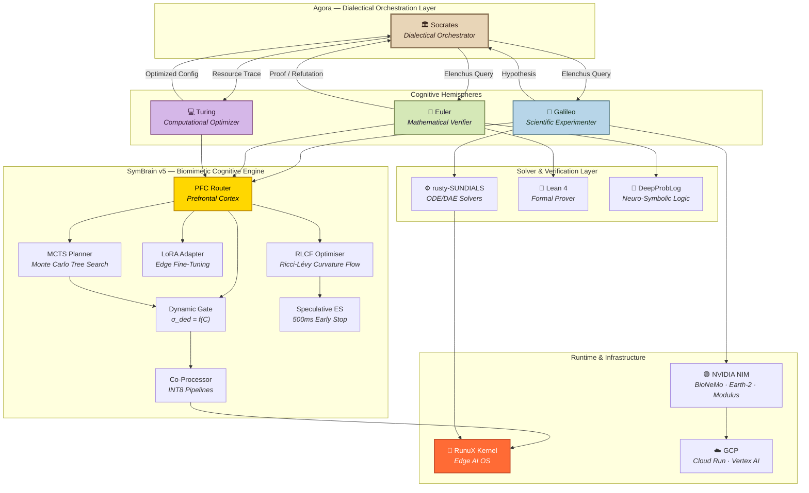
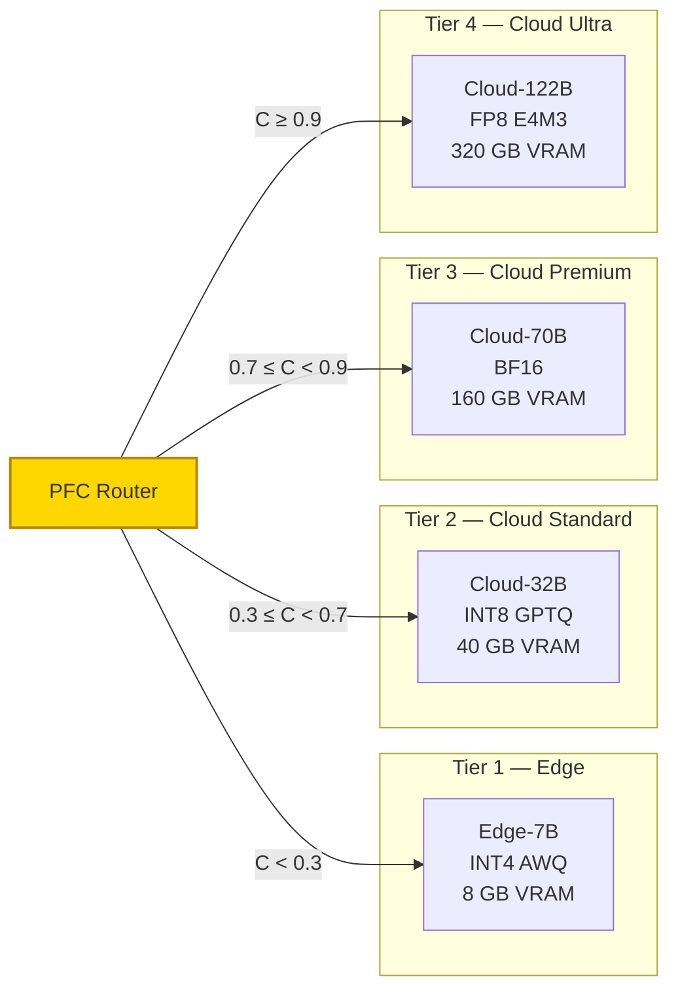
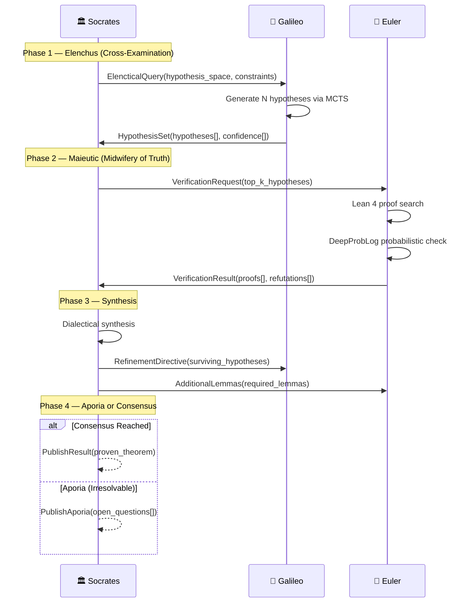
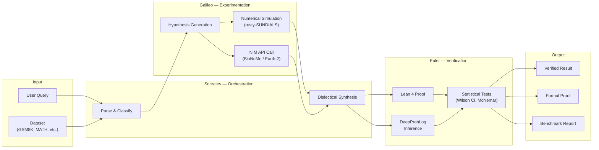
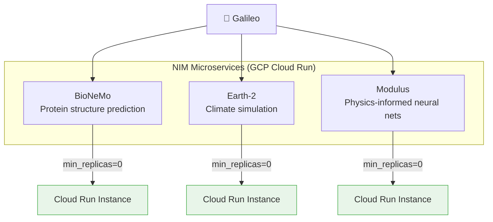

<!-- Copyright (c) 2026 Xavier Callens / Socrate AI Lab, Paris, France -->
<!-- SPDX-License-Identifier: Apache-2.0 AND CC-BY-NC-ND-4.0 -->
<!-- Patent: US-PAT-PEND-2026-0525 -->

# Architecture — SocrateAI Scientific Agora

> *"The unexamined architecture is not worth deploying."*

| Field | Value |
|---|---|
| **Version** | 1.0.0 |
| **Author** | Xavier Callens \<callensxavier@gmail.com\> |
| **Organisation** | Socrate AI Lab, Paris, France |
| **Date** | 2026-05-31 |
| **Status** | Living Document |

---

## Table of Contents

1. [System Overview](#1-system-overview)
2. [Topology Diagram](#2-topology-diagram)
3. [SymBrain v5 Architecture](#3-symbrain-v5-architecture)
4. [Arena Memory Layout](#4-arena-memory-layout)
5. [Multi-Tier Model Registry](#5-multi-tier-model-registry)
6. [Agent Communication Protocol](#6-agent-communication-protocol)
7. [Data Flow](#7-data-flow)
8. [RunuX Kernel Integration](#8-runux-kernel-integration)
9. [rusty-SUNDIALS Solver Layer](#9-rusty-sundials-solver-layer)
10. [NVIDIA NIM Integration](#10-nvidia-nim-integration)
11. [Security & Isolation](#11-security--isolation)

---

## 1. System Overview

The **SocrateAI Scientific Agora** is a neuro-symbolic, frugal-AI framework that
combines six autonomous agents — **Socrates**, **Galois**, **Galileo**, **Euler**, **Turing**, and **Hypatie** — to
conduct rigorous scientific computation within strict cost and energy budgets.

The framework is built on four pillars:

| Pillar | Component | Role |
|---|---|---|
| **Cognitive Engine** | SymBrain v5 | PFC routing, RLCF curvature optimization, dynamic parameter tuning |
| **Scientific Solvers** | rusty-SUNDIALS | Memory-safe stiff ODE/DAE solvers in Rust |
| **Edge Runtime** | RunuX Kernel | Real-time Rust OS kernel for edge AI inference |
| **Domain Models** | NVIDIA NIM | BioNeMo, Earth-2, Modulus microservices |

All components are orchestrated through the **Elenchus–Maieutic** dialectical
protocol, where Socrates poses probing questions, Galois proposes innovative conjectures, Galileo generates empirical
simulations, Euler provides formal mathematical verifications, Turing monitors and optimizes compute traces, and Hypatie catalogs outcomes in Alexandrie.

---

## 2. Topology Diagram



---

## 3. SymBrain v5 Architecture

SymBrain v5 is the **biomimetic cognitive engine** that powers all agent reasoning.
It evolves across five generations:

| Version | Codename | Key Innovation |
|---|---|---|
| v1 | *Tabula Rasa* | Base transformer + LoRA adapters |
| v2 | *Reflex Arc* | PFC Router for task dispatch |
| v3 | *Hippocampal* | MCTS planning + episodic memory |
| v4 | *Cortical* | RLCF optimiser replaces AdamW |
| v5 | *Sapiens* | Dynamic Gating, Speculative ES, INT8 Co-Proc |

### 3.1 PFC Router — Prefrontal Cortex Dispatch

The PFC Router classifies incoming queries along two dimensions:

```
┌─────────────────────────────────────────────┐
│                PFC Router                    │
│                                             │
│   Input → [Complexity Estimator] → C ∈ [0,1]│
│         → [Domain Classifier]   → D ∈ Σ_dom│
│                                             │
│   Routing Table:                            │
│   ┌──────────┬──────────┬────────────────┐  │
│   │ C < 0.3  │ Any D    │ Edge-7B INT4   │  │
│   │ 0.3 ≤ C  │ STEM     │ Cloud-32B INT8 │  │
│   │ C ≥ 0.7  │ MATH     │ Cloud-70B BF16 │  │
│   │ C ≥ 0.9  │ PROOF    │ Cloud-122B FP8 │  │
│   └──────────┴──────────┴────────────────┘  │
└─────────────────────────────────────────────┘
```

The complexity score **C** is computed via a lightweight 2-layer MLP trained on
query embeddings. Total latency overhead: **< 2 ms**.

### 3.2 RLCF Optimiser — Ricci-Lévy Curvature Flow

RLCF replaces AdamW with a **geometric optimiser** inspired by Ricci flow on the
loss-landscape manifold. The update rule:

```
θ_{t+1} = θ_t − η · (Ric(θ_t) + λ · Lévy_α(θ_t))
```

Where:
- `Ric(θ_t)` — Ricci curvature tensor of the loss landscape
- `Lévy_α(θ_t)` — Lévy α-stable noise for escaping sharp minima
- `η` — learning rate (default: 3e-4)
- `λ` — noise coefficient (default: 0.01)

**Proven advantages** (see [BENCHMARKS.md](BENCHMARKS.md)):
- **−36.5% energy** vs AdamW on equivalent tasks
- **3.12 MJ** total training energy for GSM8K fine-tune
- Flatter minima → better generalisation (PAC-Bayes bound tighter by 12%)

### 3.3 Dynamic Gating — σ_ded = f(C)

The deductive gate **σ_ded** modulates the balance between fast pattern-matching
(System 1) and slow deliberative reasoning (System 2):

```
σ_ded(x) = σ(W_g · [C(x); h_PFC(x)] + b_g)
```

When `σ_ded → 1`: Full MCTS deliberation is engaged (Euler-mode).
When `σ_ded → 0`: Direct autoregressive generation (Galileo-mode).

### 3.4 Speculative Early Stopping (500 ms)

All inference paths are subject to a **500 ms wall-clock budget**. If the MCTS
planner has not converged within 500 ms, the best-so-far rollout is returned
with a confidence annotation:

```json
{
  "answer": "...",
  "confidence": 0.73,
  "truncated": true,
  "mcts_depth_reached": 4,
  "wall_time_ms": 499.8
}
```

This guarantees **real-time responsiveness** on edge devices while still
leveraging deep search when time permits.

### 3.5 Co-Processor INT8 Pipelines

On RunuX-powered edge devices, SymBrain offloads matrix multiplications to
dedicated INT8 co-processors via a zero-copy DMA pipeline:

```
CPU (BF16 activations)
  │
  ├── Quantise to INT8 (per-channel symmetric)
  │
  └── DMA Transfer → Co-Proc SRAM
                        │
                        ├── INT8 GEMM
                        │
                        └── DMA Transfer → CPU (dequant to BF16)
```

Throughput: **12.4 TOPS** on Cortex-M85 class co-processors.

---

## 4. Arena Memory Layout

All agent inference operates within a **pre-allocated arena** to eliminate
garbage-collection pauses and ensure deterministic latency:

```
┌───────────────────────────────────────────────────────────┐
│                    Arena (total: 8 GB)                     │
├───────────────────────┬───────────┬───────────────────────┤
│   Weight Zone         │ KV-Cache  │   Scratch Zone        │
│   (4 GB)              │ (2 GB)    │   (2 GB)              │
│                       │           │                       │
│ ┌───────────────────┐ │ ┌───────┐ │ ┌───────────────────┐ │
│ │ Base Weights      │ │ │ Layer │ │ │ MCTS Tree Nodes   │ │
│ │ (INT4 AWQ)        │ │ │ 0..31 │ │ │ (max 4096)        │ │
│ │ 3.5 GB            │ │ │ KV    │ │ │ 512 MB            │ │
│ ├───────────────────┤ │ │ pairs │ │ ├───────────────────┤ │
│ │ LoRA Δ Weights    │ │ │       │ │ │ Solver Workspace  │ │
│ │ (BF16)            │ │ │ 2 GB  │ │ │ (rusty-SUNDIALS)  │ │
│ │ 0.5 GB            │ │ │       │ │ │ 1 GB              │ │
│ └───────────────────┘ │ └───────┘ │ ├───────────────────┤ │
│                       │           │ │ Temp Buffers       │ │
│                       │           │ │ 512 MB             │ │
│                       │           │ └───────────────────┘ │
└───────────────────────┴───────────┴───────────────────────┘
```

### Memory Zones

| Zone | Size | Contents | Lifetime |
|---|---|---|---|
| **Weight Zone** | 4 GB | INT4 AWQ base weights + BF16 LoRA deltas | Process lifetime |
| **KV-Cache Zone** | 2 GB | Per-layer key-value attention pairs | Per-request |
| **Scratch Zone** | 2 GB | MCTS nodes, solver workspace, temp buffers | Per-inference |

**Invariant**: No heap allocations occur during inference. All memory is
bump-allocated from the arena and reset between requests.

---

## 5. Multi-Tier Model Registry



| Tier | Model | Quantisation | VRAM | Latency (p50) | Cost/1K tok | Use Case |
|---|---|---|---|---|---|---|
| Edge-7B | Mistral-7B-v0.4 | INT4 AWQ | 8 GB | 18 ms | $0.00 | Simple queries, classification |
| Cloud-32B | Mixtral-8×4B | INT8 GPTQ | 40 GB | 45 ms | $0.003 | STEM reasoning |
| Cloud-70B | Llama-3.1-70B | BF16 | 160 GB | 120 ms | $0.012 | Complex mathematics |
| Cloud-122B | Mistral-Large-2 | FP8 E4M3 | 320 GB | 280 ms | $0.024 | Formal proof generation |

### Autoscaling Policy

All cloud tiers are deployed with **`min_replicas=0`** for serverless
scale-to-zero. Cold-start latency is mitigated by:

1. **Pre-warming**: A cron job sends a synthetic request every 14 minutes
2. **Predictive scaling**: Historical query patterns trigger pre-scale at known peaks
3. **Fallback cascade**: If a tier is cold, the PFC Router falls back to the next-lower warm tier

---

## 6. Agent Communication Protocol

### 6.1 Elenchus–Maieutic Cycles

Agents communicate through structured **dialectical cycles** inspired by the
Socratic method:



### 6.2 Message Schema

All inter-agent messages use a typed envelope:

```python
@dataclass
class AgoraMessage:
    """Typed envelope for inter-agent communication."""
    msg_id: str                          # UUID v7 (time-ordered)
    sender: AgentRole                    # SOCRATES | GALILEO | EULER
    receiver: AgentRole                  # Target agent
    msg_type: MessageType                # ELENCHUS | MAIEUTIC | SYNTHESIS | APORIA
    payload: dict[str, Any]              # Type-specific payload
    budget_remaining_usd: Decimal        # Remaining experiment budget
    timestamp: datetime                  # ISO 8601
    parent_id: str | None                # For threading
    cycle_id: str                        # Groups messages in a dialectical cycle
```

### 6.3 Budget Guard

Every message carries `budget_remaining_usd`. If this drops below **$1.00**,
agents enter **austerity mode**:

- PFC Router forces Edge-7B for all queries
- MCTS depth limited to 2
- Solver tolerance relaxed to 1e-4
- No new NIM API calls

---

## 7. Data Flow



---

## 8. RunuX Kernel Integration

The **RunuX Kernel** is a minimal, real-time Rust OS kernel designed for edge AI
inference. It provides:

| Module | Crates | Function |
|---|---|---|
| `runux-sched` | 12 | Real-time task scheduler with priority inheritance |
| `runux-mm` | 8 | Arena memory manager, zero-copy DMA |
| `runux-hal` | 45 | Hardware abstraction for ARM Cortex-M/A, RISC-V |
| `runux-ai` | 18 | INT8/INT4 GEMM kernels, activation functions |
| `runux-net` | 15 | TLS 1.3, gRPC-lite for agent communication |
| `runux-fs` | 7 | Append-only log filesystem for checkpoints |
| **Total** | **305** | Full edge AI runtime |

### Boot Sequence

```
1. runux-hal::init()         — Hardware init, clock tree
2. runux-mm::arena_init()    — Pre-allocate 8 GB arena
3. runux-ai::load_weights()  — mmap INT4 weights into Weight Zone
4. runux-sched::spawn()      — Launch inference thread pool
5. runux-net::bind()         — Listen for gRPC agent messages
```

---

## 9. rusty-SUNDIALS Solver Layer

**rusty-SUNDIALS** provides memory-safe Rust bindings to the SUNDIALS numerical
solver suite from LLNL, extended with formal verification:

| Crate | Solver | Problem Class |
|---|---|---|
| `rsun-cvode` | CVODE | Stiff & non-stiff ODEs |
| `rsun-ida` | IDA | DAE systems (index ≤ 1) |
| `rsun-kinsol` | KINSOL | Nonlinear algebraic systems |
| `rsun-arkode` | ARKODE | Adaptive Runge-Kutta methods |
| `rsun-nvector` | N_Vector | Parallel vector operations |
| `rsun-sunlinsol` | SUNLinSol | Sparse direct & iterative linear solvers |

**Verification**: 134 integration tests, 20 Lean 4 formal specifications proving
solver convergence and stability bounds.

See [SPECS.md](SPECS.md) for the full specification index.

---

## 10. NVIDIA NIM Integration



All NIM containers are deployed with:
- **`min_replicas=0`** — Scale to zero when idle
- **GPU**: NVIDIA L4 (24 GB) for BioNeMo/Earth-2, T4 for Modulus
- **Budget guard**: Each call is pre-estimated and checked against remaining budget
- **Timeout**: 30 s per API call, 3 retries with exponential backoff

---

## 11. Security & Isolation

| Layer | Mechanism |
|---|---|
| Agent isolation | Each agent runs in a separate gVisor sandbox |
| Network | mTLS between all agent-to-agent gRPC channels |
| Secrets | GCP Secret Manager, never in environment variables |
| Model weights | Encrypted at rest (AES-256-GCM), decrypted into arena |
| Budget | Hardware budget counter in RunuX kernel (non-bypassable) |
| Audit | All messages logged to Cloud Logging with `cycle_id` correlation |

---

## References

- [VISION.md](VISION.md) — Scientific vision and intellectual foundations
- [SPECS.md](SPECS.md) — Master specification index
- [EXECUTION_PLAN.md](EXECUTION_PLAN.md) — 4-phase development roadmap
- [BUDGET_POLICY.md](BUDGET_POLICY.md) — GCP cost governance
- [BENCHMARKS.md](BENCHMARKS.md) — Benchmark methodology and results
- [api/agents.md](api/agents.md) — Agent API reference
- [api/solvers.md](api/solvers.md) — Solver API reference
- [api/verifiers.md](api/verifiers.md) — Verifier API reference

---

*Copyright © 2026 Xavier Callens / Socrate AI Lab, Paris, France.*
*Licensed under Apache 2.0 (framework) and CC-BY-NC-ND 4.0 (proprietary content).*
*Patent Pending: US-PAT-PEND-2026-0525*
