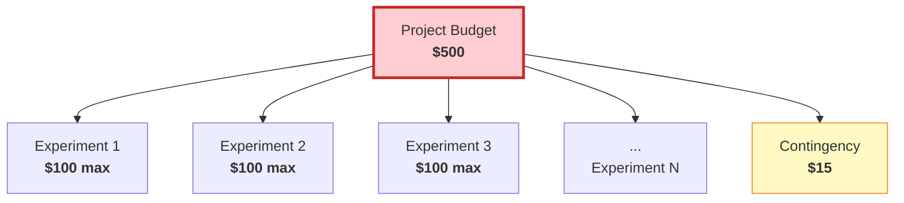

<!-- Copyright (c) 2026 Xavier Callens / Socrate AI Lab, Paris, France -->
<!-- SPDX-License-Identifier: Apache-2.0 AND CC-BY-NC-ND-4.0 -->
<!-- Patent: US-PAT-PEND-2026-0525 -->

# Budget Policy — SocrateAI Scientific Agora

> *"Frugality is the mother of all virtues."* — Justinian I

| Field | Value |
|---|---|
| **Version** | 1.0.0 |
| **Author** | Xavier Callens \<callensxavier@gmail.com\> |
| **Organisation** | Socrate AI Lab, Paris, France |
| **Date** | 2026-05-31 |
| **Enforcement** | Mandatory — all agents, all environments |

---

## Table of Contents

1. [Budget Ceilings](#1-budget-ceilings)
2. [Serverless Enforcement](#2-serverless-enforcement)
3. [Cost Estimation Formulas](#3-cost-estimation-formulas)
4. [Budget Alert Thresholds](#4-budget-alert-thresholds)
5. [Billing Export to BigQuery](#5-billing-export-to-bigquery)
6. [Monthly Burn Rate Monitoring](#6-monthly-burn-rate-monitoring)
7. [Agent-Level Budget Guards](#7-agent-level-budget-guards)
8. [Austerity Mode](#8-austerity-mode)
9. [Cost Optimisation Strategies](#9-cost-optimisation-strategies)
10. [Audit & Compliance](#10-audit--compliance)

---

## 1. Budget Ceilings

All budgets are **hard limits** enforced by both software guards and GCP billing
alerts. Exceeding any ceiling is a **blocking incident**.

| Scope | Ceiling | Enforcement |
|---|---|---|
| Per experiment | **$100 USD** | Software guard in `BudgetGuard` class |
| Per project (total) | **$500 USD** | GCP billing budget + programmatic shutdown |
| Per NIM API call | **$0.50 USD** | Pre-estimation check before each call |
| Per benchmark run | **$100 USD** | Benchmark runner pre-estimates total cost |

### 1.1 Budget Hierarchy



### 1.2 Budget Flow per Experiment

```
Experiment starts with $100.00
  │
  ├── Galileo consumes: solver calls, NIM calls, compute
  │     └── Each call: pre-estimate → check budget → execute → deduct
  │
  ├── Euler consumes: Lean 4 CPU, DeepProbLog inference
  │     └── Each proof: pre-estimate → check budget → execute → deduct
  │
  ├── Socrates consumes: orchestration overhead (~10%)
  │     └── Minimal: message routing, logging
  │
  └── Remaining budget → returned to project pool
```

---

## 2. Serverless Enforcement

**All Cloud Run services MUST be deployed with `min_replicas=0`.**

This is non-negotiable. Any deployment configuration with `min_replicas > 0`
will be rejected by CI/CD checks.

### 2.1 Terraform Enforcement

```hcl
# deploy/terraform/modules/cloud_run/main.tf
resource "google_cloud_run_v2_service" "agent" {
  # ...
  template {
    scaling {
      min_instance_count = 0    # MANDATORY — serverless scale-to-zero
      max_instance_count = 3    # Cost ceiling
    }
  }

  lifecycle {
    precondition {
      condition     = self.template[0].scaling[0].min_instance_count == 0
      error_message = "BUDGET VIOLATION: min_replicas must be 0 for serverless."
    }
  }
}
```

### 2.2 CI/CD Enforcement

The GitHub Actions pipeline includes a pre-deploy check:

```yaml
# .github/workflows/deploy.yml
- name: Enforce min_replicas=0
  run: |
    # Scan all Terraform and YAML configs for min_replicas > 0
    if grep -rn 'min_instance_count\s*=\s*[1-9]' deploy/; then
      echo "❌ BUDGET VIOLATION: min_replicas > 0 detected!"
      exit 1
    fi
    if grep -rn 'minScale:\s*[1-9]' deploy/; then
      echo "❌ BUDGET VIOLATION: minScale > 0 detected!"
      exit 1
    fi
    echo "✅ All services configured for serverless (min_replicas=0)"
```

### 2.3 Cold-Start Mitigation

Since `min_replicas=0` introduces cold-start latency, we mitigate with:

| Strategy | Implementation | Added Cost |
|---|---|---|
| Pre-warming cron | Cloud Scheduler pings every 14 min | ~$0.50/month |
| Predictive scaling | Historical patterns trigger pre-scale | $0 (built-in) |
| Tier fallback | PFC Router falls back to warm lower tier | $0 |
| Container optimisation | Multi-stage builds, minimal base image | $0 |

---

## 3. Cost Estimation Formulas

### 3.1 GPU Compute Cost

All costs are per-second billing with the following rates:

| GPU Type | VRAM | Cost/Hour | Cost/Second | Typical Workload |
|---|---|---|---|---|
| **NVIDIA T4** | 16 GB | $0.35 | $0.0000972 | Modulus inference |
| **NVIDIA L4** | 24 GB | $0.70 | $0.0001944 | BioNeMo, Earth-2, benchmarks |
| **NVIDIA A100 40GB** | 40 GB | $3.67 | $0.001019 | Cloud-32B training |
| **NVIDIA A100 80GB** | 80 GB | $5.12 | $0.001422 | Cloud-70B inference |
| **TPU v5e** (1 chip) | 16 GB HBM | $1.20 | $0.000333 | LoRA fine-tuning |

### 3.2 Cost Estimation Formula

For any GPU workload:

```
cost_usd = gpu_seconds × cost_per_second × overhead_factor

Where:
  gpu_seconds    = wall_time_s × num_gpus
  overhead_factor = 1.15  (15% margin for scheduling, data transfer)
```

### 3.3 NIM API Cost

```
nim_cost_usd = num_calls × cost_per_call

BioNeMo:  $0.05 / call
Earth-2:  $0.08 / call
Modulus:  $0.03 / call
```

### 3.4 Cloud Run Compute (CPU-only agents)

```
cpu_cost_usd = (vcpu_seconds × $0.00002400) + (gb_seconds × $0.00000250)

Example (Socrates, 2 vCPU, 4 GB, 300s):
  = (2 × 300 × $0.00002400) + (4 × 300 × $0.00000250)
  = $0.0144 + $0.003
  = $0.0174 per experiment
```

### 3.5 Pre-Estimation Implementation

```python
# core/src/telemetry/budget.py
from decimal import Decimal

class CostEstimator:
    """Pre-estimates cost before executing any cloud operation."""

    GPU_RATES: dict[str, Decimal] = {
        "T4":       Decimal("0.0000972"),
        "L4":       Decimal("0.0001944"),
        "A100-40":  Decimal("0.001019"),
        "A100-80":  Decimal("0.001422"),
        "TPUv5e":   Decimal("0.000333"),
    }

    NIM_RATES: dict[str, Decimal] = {
        "bionemo":  Decimal("0.05"),
        "earth2":   Decimal("0.08"),
        "modulus":  Decimal("0.03"),
    }

    OVERHEAD_FACTOR = Decimal("1.15")

    @classmethod
    def estimate_gpu(
        cls,
        gpu_type: str,
        wall_time_s: float,
        num_gpus: int = 1,
    ) -> Decimal:
        rate = cls.GPU_RATES[gpu_type]
        return rate * Decimal(str(wall_time_s)) * num_gpus * cls.OVERHEAD_FACTOR

    @classmethod
    def estimate_nim(cls, service: str, num_calls: int = 1) -> Decimal:
        return cls.NIM_RATES[service] * num_calls
```

---

## 4. Budget Alert Thresholds

### 4.1 Alert Configuration

| Threshold | % of Budget | Amount | Action |
|---|---|---|---|
| **Warning** | 10% | $50 | Slack notification, email to owner |
| **Critical** | 20% | $100 | Slack + email + PagerDuty, PFC forces Edge-7B |
| **Emergency** | 100% | $500 | **Automatic project shutdown** |

### 4.2 GCP Budget Alert Setup

```hcl
# deploy/terraform/modules/billing/main.tf
resource "google_billing_budget" "agora_budget" {
  billing_account = var.billing_account_id
  display_name    = "SocrateAI-Agora-Budget"

  budget_filter {
    projects = ["projects/${var.project_id}"]
  }

  amount {
    specified_amount {
      currency_code = "USD"
      units         = "500"
    }
  }

  threshold_rules {
    threshold_percent = 0.10   # $50 — Warning
    spend_basis       = "CURRENT_SPEND"
  }

  threshold_rules {
    threshold_percent = 0.20   # $100 — Critical
    spend_basis       = "CURRENT_SPEND"
  }

  threshold_rules {
    threshold_percent = 1.00   # $500 — Emergency shutdown
    spend_basis       = "CURRENT_SPEND"
  }

  all_updates_rule {
    monitoring_notification_channels = [
      google_monitoring_notification_channel.email.name,
      google_monitoring_notification_channel.slack.name,
    ]
    disable_default_iam_recipients = false
  }
}
```

### 4.3 Programmatic Shutdown

When the $500 threshold is breached, a Cloud Function automatically:

1. Sets all Cloud Run services to `max_instances=0`
2. Revokes all service account tokens
3. Sends emergency notification to all channels
4. Creates an incident in Cloud Monitoring

```python
# scripts/emergency_shutdown.py
def emergency_shutdown(project_id: str) -> None:
    """Kill all Cloud Run services when budget is exhausted."""
    from google.cloud import run_v2

    client = run_v2.ServicesClient()
    parent = f"projects/{project_id}/locations/-"

    for service in client.list_services(parent=parent):
        # Set max instances to 0 — effectively kills the service
        service.template.scaling.max_instance_count = 0
        client.update_service(service=service)
        print(f"🛑 Shut down: {service.name}")
```

---

## 5. Billing Export to BigQuery

### 5.1 Export Configuration

All billing data is exported to BigQuery for analysis:

```hcl
# deploy/terraform/modules/billing/bigquery.tf
resource "google_bigquery_dataset" "billing" {
  dataset_id = "agora_billing"
  location   = "EU"

  default_table_expiration_ms = null  # Keep forever
}

resource "google_billing_account_iam_member" "bigquery_export" {
  billing_account_id = var.billing_account_id
  role               = "roles/billing.viewer"
  member             = "serviceAccount:${var.export_sa_email}"
}
```

### 5.2 Analysis Queries

**Daily spend by service:**

```sql
SELECT
  DATE(usage_start_time) AS day,
  service.description AS service,
  SUM(cost) AS daily_cost_usd
FROM `agora_billing.gcp_billing_export_v1_*`
WHERE project.id = 'socrateai-agora'
GROUP BY day, service
ORDER BY day DESC, daily_cost_usd DESC;
```

**Cumulative spend (running total):**

```sql
SELECT
  DATE(usage_start_time) AS day,
  SUM(cost) AS daily_cost,
  SUM(SUM(cost)) OVER (ORDER BY DATE(usage_start_time)) AS cumulative_cost
FROM `agora_billing.gcp_billing_export_v1_*`
WHERE project.id = 'socrateai-agora'
GROUP BY day
ORDER BY day;
```

**GPU utilisation vs cost:**

```sql
SELECT
  sku.description,
  SUM(usage.amount) AS total_gpu_seconds,
  SUM(cost) AS total_cost_usd,
  SAFE_DIVIDE(SUM(cost), SUM(usage.amount)) AS cost_per_gpu_second
FROM `agora_billing.gcp_billing_export_v1_*`
WHERE project.id = 'socrateai-agora'
  AND sku.description LIKE '%GPU%'
GROUP BY sku.description
ORDER BY total_cost_usd DESC;
```

---

## 6. Monthly Burn Rate Monitoring

### 6.1 Burn Rate Formula

```
monthly_burn_rate = (current_spend / days_elapsed) × 30

projected_total = current_spend + (monthly_burn_rate × remaining_months)
```

### 6.2 Monitoring Dashboard

A Cloud Monitoring dashboard tracks:

| Metric | Source | Alert Threshold |
|---|---|---|
| Daily spend | Billing export | > $20/day |
| GPU utilisation | DCGM exporter | < 30% (waste alert) |
| Cloud Run active instances | Cloud Run metrics | > 0 for > 30 min idle |
| NIM API call count | Custom metric | > 50/day |
| Experiment count | Application logs | > 5/day |

### 6.3 Weekly Report

A Cloud Scheduler job triggers a weekly cost report:

```
📊 SocrateAI Agora — Weekly Cost Report
═══════════════════════════════════════
Period:         2026-06-02 to 2026-06-08
Total Spend:    $42.50
Daily Average:  $6.07
Burn Rate:      $182/month

Budget Remaining: $457.50 / $500.00
Projected Exhaustion: 2026-08-22

Top Costs:
  1. Cloud Run (GPU)    $28.00 (65.9%)
  2. NIM API calls      $8.50 (20.0%)
  3. Cloud Run (CPU)    $3.50 (8.2%)
  4. BigQuery           $1.50 (3.5%)
  5. Other              $1.00 (2.4%)

Status: ✅ ON TRACK
```

---

## 7. Agent-Level Budget Guards

### 7.1 BudgetGuard Class

```python
# core/src/telemetry/budget.py
from decimal import Decimal
from threading import Lock

class BudgetGuard:
    """Thread-safe budget enforcement for experiments.

    Raises BudgetExhaustedError if any operation would exceed
    the remaining budget. All amounts are in USD.
    """

    def __init__(self, experiment_budget: Decimal = Decimal("100.00")):
        self._budget = experiment_budget
        self._spent = Decimal("0.00")
        self._lock = Lock()

    @property
    def remaining(self) -> Decimal:
        with self._lock:
            return self._budget - self._spent

    def pre_approve(self, estimated_cost: Decimal) -> bool:
        """Check if estimated cost fits within remaining budget."""
        with self._lock:
            return (self._spent + estimated_cost) <= self._budget

    def deduct(self, actual_cost: Decimal) -> Decimal:
        """Deduct cost from budget. Raises if insufficient."""
        with self._lock:
            if (self._spent + actual_cost) > self._budget:
                raise BudgetExhaustedError(
                    f"Cost ${actual_cost} would exceed budget. "
                    f"Remaining: ${self._budget - self._spent}"
                )
            self._spent += actual_cost
            return self._budget - self._spent

    @property
    def in_austerity(self) -> bool:
        """Returns True when budget < $1.00."""
        return self.remaining < Decimal("1.00")
```

### 7.2 Integration with Agents

Every agent call is wrapped with budget checks:

```python
async def call_nim(self, service: str, payload: dict) -> dict:
    """Make a NIM API call with budget pre-approval."""
    estimated = CostEstimator.estimate_nim(service)

    if not self.budget.pre_approve(estimated):
        raise BudgetExhaustedError(
            f"NIM call to {service} (est. ${estimated}) "
            f"exceeds remaining budget ${self.budget.remaining}"
        )

    result = await self._nim_client.call(service, payload)
    self.budget.deduct(estimated)  # Use estimate as actual
    return result
```

---

## 8. Austerity Mode

When experiment budget drops below **$1.00**, agents enter **austerity mode**:

| Component | Normal Mode | Austerity Mode |
|---|---|---|
| PFC Router | Routes to optimal tier | Forces Edge-7B only |
| MCTS depth | Up to 8 | Limited to 2 |
| MCTS rollouts | 64 | 8 |
| Solver tolerance | 1e-8 | 1e-4 |
| NIM API calls | Allowed | **Blocked** |
| Lean 4 timeout | 60 s | 15 s |
| Speculative ES | 500 ms | 100 ms |

Austerity mode is **automatic and non-bypassable**. It ensures that no
experiment can accidentally exhaust the project budget.

---

## 9. Cost Optimisation Strategies

### 9.1 Implemented

| Strategy | Savings | Implementation |
|---|---|---|
| Scale-to-zero (min_replicas=0) | ~$200/month vs always-on | Terraform + CI check |
| INT4/INT8 quantisation | −60% GPU cost vs FP16 | AWQ/GPTQ quantisation |
| PFC Router tier selection | −40% average cost | Complexity-based routing |
| Spot/preemptible instances | −60% for batch jobs | Terraform configuration |
| Regional selection (europe-west1) | Lowest EU pricing | Terraform variable |

### 9.2 Planned

| Strategy | Estimated Savings | Timeline |
|---|---|---|
| Request batching (Galileo) | −15% NIM costs | Phase 2 |
| KV-cache sharing across agents | −20% memory → smaller instances | Phase 3 |
| Distilled PFC Router (< 1MB) | −5% overhead | Phase 4 |

---

## 10. Audit & Compliance

### 10.1 Audit Trail

Every cost-incurring operation is logged with:

```json
{
  "timestamp": "2026-06-15T14:30:00Z",
  "experiment_id": "exp-2026-0615-001",
  "agent": "galileo",
  "operation": "nim_call",
  "service": "bionemo",
  "estimated_cost_usd": "0.05",
  "actual_cost_usd": "0.048",
  "budget_remaining_usd": "87.52",
  "cycle_id": "cycle-abc123"
}
```

### 10.2 Monthly Audit Checklist

- [ ] Verify billing export data matches GCP console
- [ ] Confirm all services have `min_replicas=0`
- [ ] Review top 10 cost line items for waste
- [ ] Check GPU utilisation (target: > 70% when running)
- [ ] Verify no orphaned resources (disks, IPs, snapshots)
- [ ] Confirm budget alerts are functioning (test trigger)

### 10.3 Escalation Path

| Event | Response Time | Responder | Action |
|---|---|---|---|
| $50 threshold | 24 hours | XC (owner) | Review and acknowledge |
| $100 threshold | 4 hours | XC (owner) | Investigate, enable austerity |
| $500 threshold | **Immediate** | Automated | Emergency shutdown |

---

## Cross-References

- [ARCHITECTURE.md](ARCHITECTURE.md) — System topology
- [EXECUTION_PLAN.md](EXECUTION_PLAN.md) — Budget allocation by phase
- [BENCHMARKS.md](BENCHMARKS.md) — Benchmark cost estimates
- [SPECS.md](SPECS.md) — NIM service cost contracts

---

*Copyright © 2026 Xavier Callens / Socrate AI Lab, Paris, France.*
*Licensed under Apache 2.0 (framework) and CC-BY-NC-ND 4.0 (proprietary content).*
*Patent Pending: US-PAT-PEND-2026-0525*
