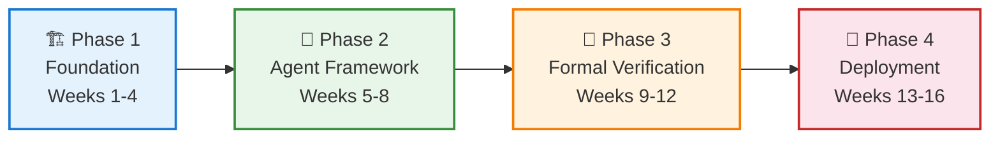
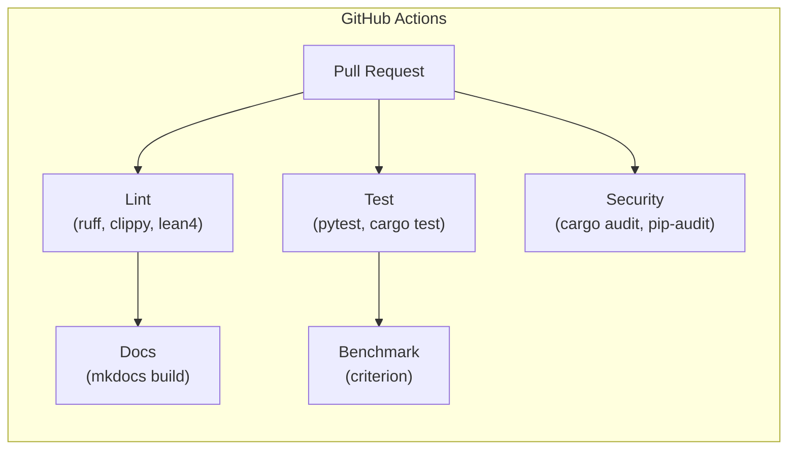
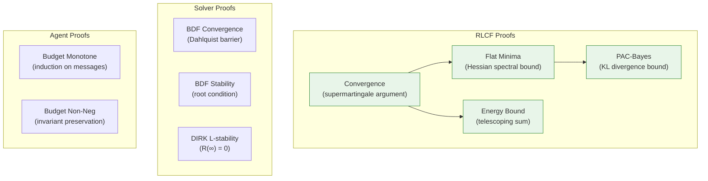
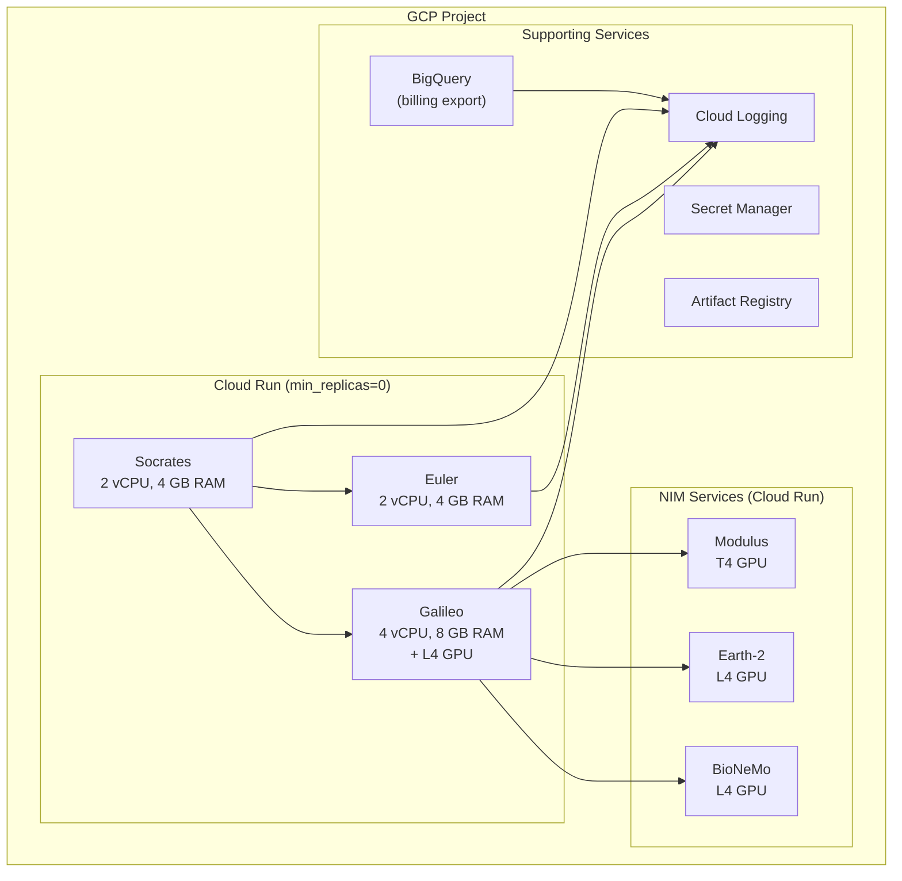
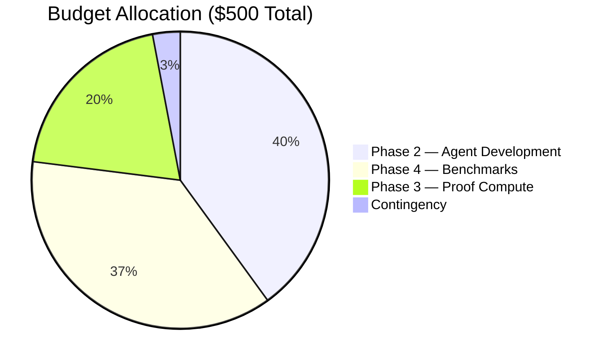

<!-- Copyright (c) 2026 Xavier Callens / Socrate AI Lab, Paris, France -->
<!-- SPDX-License-Identifier: Apache-2.0 AND CC-BY-NC-ND-4.0 -->
<!-- Patent: US-PAT-PEND-2026-0525 -->

# Execution Plan — SocrateAI Scientific Agora

> *"Plans are nothing; planning is everything."* — Dwight D. Eisenhower

| Field | Value |
|---|---|
| **Version** | 1.0.0 |
| **Author** | Xavier Callens \<callensxavier@gmail.com\> |
| **Organisation** | Socrate AI Lab, Paris, France |
| **Date** | 2026-05-31 |
| **Total Budget** | $500 USD |
| **Timeline** | 16 weeks (4 phases × 4 weeks) |

---

## Table of Contents

1. [Roadmap Overview](#1-roadmap-overview)
2. [Gantt Chart](#2-gantt-chart)
3. [Phase 1 — Foundation](#3-phase-1--foundation)
4. [Phase 2 — Agent Framework](#4-phase-2--agent-framework)
5. [Phase 3 — Formal Verification](#5-phase-3--formal-verification)
6. [Phase 4 — Deployment](#6-phase-4--deployment)
7. [Risk Register](#7-risk-register)
8. [Success Criteria](#8-success-criteria)
9. [Budget Allocation](#9-budget-allocation)

---

## 1. Roadmap Overview



| Phase | Focus | Duration | Budget | Key Deliverable |
|---|---|---|---|---|
| 1 — Foundation | Repository, docs, CI/CD | 4 weeks | $0 | Production-ready repo structure |
| 2 — Agent Framework | Galileo, Euler, Socrates | 4 weeks | $200 | Working 3-agent dialectical system |
| 3 — Formal Verification | Lean 4 proofs, DeepProbLog | 4 weeks | $100 | 13+ proven theorems |
| 4 — Deployment | Terraform, Docker, benchmarks | 4 weeks | $200 | Deployed system with published benchmarks |

---

## 2. Gantt Chart

```mermaid
gantt
    title SocrateAI Scientific Agora — 16-Week Execution Plan
    dateFormat YYYY-MM-DD
    axisFormat %b %d

    section Phase 1 — Foundation
    Repository setup             :p1a, 2026-06-02, 3d
    Documentation suite          :p1b, after p1a, 5d
    CI/CD pipeline (GitHub Actions) :p1c, after p1a, 5d
    SymBrain v1-v4 core stubs    :p1d, after p1b, 5d
    rusty-SUNDIALS FFI bindings  :p1e, after p1b, 7d
    Arena memory allocator       :p1f, after p1d, 4d
    Milestone 1: Foundation      :milestone, m1, after p1f, 0d

    section Phase 2 — Agent Framework
    AGY SDK integration          :p2a, after m1, 5d
    Galileo agent (experimenter) :p2b, after p2a, 7d
    Euler agent (verifier)       :p2c, after p2a, 7d
    Socrates agent (orchestrator):p2d, after p2b, 5d
    Budget guard implementation  :p2e, after p2a, 3d
    Elenchus-Maieutic protocol   :p2f, after p2d, 5d
    NVIDIA NIM integration       :p2g, after p2b, 5d
    PFC Router training          :p2h, after p2f, 3d
    Milestone 2: Agents          :milestone, m2, after p2h, 0d

    section Phase 3 — Formal Verification
    RLCF convergence proof       :p3a, after m2, 7d
    RLCF flat-minima proof       :p3b, after p3a, 5d
    Solver convergence proofs    :p3c, after m2, 10d
    Agent budget proofs          :p3d, after m2, 5d
    DeepProbLog programs         :p3e, after p3d, 7d
    PAC-Bayes bound proof        :p3f, after p3b, 5d
    Proof review and polish      :p3g, after p3f, 3d
    Milestone 3: Verification    :milestone, m3, after p3g, 0d

    section Phase 4 — Deployment
    Terraform GCP modules        :p4a, after m3, 5d
    Docker multi-stage builds    :p4b, after m3, 4d
    Cloud Run deployment         :p4c, after p4a, 3d
    GSM8K benchmark run          :p4d, after p4c, 3d
    MATH benchmark run           :p4e, after p4d, 3d
    MMLU-Physics benchmark run   :p4f, after p4e, 2d
    Energy profiling             :p4g, after p4d, 4d
    Ablation study               :p4h, after p4f, 3d
    Results publication          :p4i, after p4h, 2d
    Milestone 4: Launch          :milestone, m4, after p4i, 0d
```

---

## 3. Phase 1 — Foundation

**Objective**: Establish a production-ready repository with documentation,
CI/CD, and core infrastructure.

### 3.1 Deliverables

| # | Deliverable | Owner | Due | Status |
|---|---|---|---|---|
| 1.1 | Repository structure (monorepo) | XC | Week 1 | ✅ Complete |
| 1.2 | Documentation suite (12 docs) | XC | Week 1-2 | ✅ Complete |
| 1.3 | GitHub Actions CI/CD | XC | Week 1-2 | 📋 Planned |
| 1.4 | SymBrain v1-v4 core modules | XC | Week 2-3 | 📋 Planned |
| 1.5 | rusty-SUNDIALS Rust FFI bindings | XC | Week 2-3 | 📋 Planned |
| 1.6 | Arena memory allocator (Rust) | XC | Week 3-4 | 📋 Planned |
| 1.7 | Configuration schema (TOML) | XC | Week 2 | 📋 Planned |
| 1.8 | Development environment (devcontainer) | XC | Week 1 | 📋 Planned |

### 3.2 CI/CD Pipeline



### 3.3 Acceptance Criteria

- [ ] All 12 documentation files pass Markdown lint
- [ ] `cargo build --workspace` succeeds for all Rust crates
- [ ] `pytest` passes with 0 failures
- [ ] CI pipeline runs in < 10 minutes
- [ ] `cargo audit` reports 0 vulnerabilities
- [ ] Arena allocator benchmarks show 0 heap allocations during inference

---

## 4. Phase 2 — Agent Framework

**Objective**: Build three working agents that communicate via the
Elenchus–Maieutic protocol with budget enforcement.

### 4.1 Deliverables

| # | Deliverable | Owner | Due | Status |
|---|---|---|---|---|
| 2.1 | AGY SDK base agent class | XC | Week 5 | 📋 Planned |
| 2.2 | Galileo agent with tools | XC | Week 5-6 | 📋 Planned |
| 2.3 | Euler agent with tools | XC | Week 5-6 | 📋 Planned |
| 2.4 | Socrates orchestrator | XC | Week 6-7 | 📋 Planned |
| 2.5 | Budget guard ($100 ceiling) | XC | Week 5 | 📋 Planned |
| 2.6 | gRPC message protocol | XC | Week 7-8 | 📋 Planned |
| 2.7 | NVIDIA NIM client | XC | Week 6-7 | 📋 Planned |
| 2.8 | PFC Router (trained classifier) | XC | Week 8 | 📋 Planned |
| 2.9 | Integration tests (3 agents) | XC | Week 8 | 📋 Planned |

### 4.2 Agent Integration Test

The Phase 2 gate requires a successful end-to-end test:

```
Input:  "Solve the ODE dy/dt = -2y, y(0) = 1, and prove the solution is y = e^{-2t}"

Expected flow:
  1. Socrates parses → sends ElencticalQuery to Galileo
  2. Galileo solves via rusty-SUNDIALS → returns numerical solution
  3. Socrates sends VerificationRequest to Euler
  4. Euler proves y = e^{-2t} via Lean 4
  5. Socrates synthesises and publishes verified result
  6. Total cost < $1.00
```

### 4.3 Acceptance Criteria

- [ ] All 3 agents instantiate and respond to messages
- [ ] Elenchus–Maieutic cycle completes end-to-end
- [ ] Budget guard blocks requests when budget < $1.00
- [ ] NIM API calls succeed (BioNeMo health check)
- [ ] PFC Router correctly classifies 90%+ of test queries

---

## 5. Phase 3 — Formal Verification

**Objective**: Prove critical system properties in Lean 4 and implement
DeepProbLog probabilistic reasoning programs.

### 5.1 Deliverables

| # | Deliverable | Owner | Due | Status |
|---|---|---|---|---|
| 3.1 | RLCF convergence theorem | XC | Week 9-10 | 📋 Planned |
| 3.2 | RLCF flat-minima theorem | XC | Week 10-11 | 📋 Planned |
| 3.3 | RLCF energy bound theorem | XC | Week 10 | 📋 Planned |
| 3.4 | RLCF PAC-Bayes theorem | XC | Week 11 | 📋 Planned |
| 3.5 | Solver convergence (5 theorems) | XC | Week 9-11 | 📋 Planned |
| 3.6 | Agent budget proofs (2 theorems) | XC | Week 9-10 | 📋 Planned |
| 3.7 | DeepProbLog programs (5) | XC | Week 10-12 | 📋 Planned |
| 3.8 | Proof documentation | XC | Week 12 | 📋 Planned |

### 5.2 Proof Strategy



### 5.3 Acceptance Criteria

- [ ] ≥ 13 theorems proven (no `sorry` in final proofs)
- [ ] `lake build` succeeds on all Lean 4 files
- [ ] All 5 DeepProbLog programs pass inference tests
- [ ] Proof documentation covers all theorems with human-readable explanations

---

## 6. Phase 4 — Deployment

**Objective**: Deploy the system to GCP, run benchmarks, and publish results.

### 6.1 Deliverables

| # | Deliverable | Owner | Due | Status |
|---|---|---|---|---|
| 4.1 | Terraform GCP modules | XC | Week 13 | 📋 Planned |
| 4.2 | Docker multi-stage builds | XC | Week 13 | 📋 Planned |
| 4.3 | Cloud Run deployment (3 agents) | XC | Week 13-14 | 📋 Planned |
| 4.4 | GSM8K benchmark (N=1,319) | XC | Week 14 | 📋 Planned |
| 4.5 | MATH benchmark (N=5,000) | XC | Week 14-15 | 📋 Planned |
| 4.6 | MMLU-Physics benchmark (N=1,000) | XC | Week 15 | 📋 Planned |
| 4.7 | Energy profiling | XC | Week 14-15 | 📋 Planned |
| 4.8 | Ablation study | XC | Week 15-16 | 📋 Planned |
| 4.9 | Results publication (benchmarks/) | XC | Week 16 | 📋 Planned |
| 4.10 | README and release notes | XC | Week 16 | 📋 Planned |

### 6.2 Deployment Architecture



### 6.3 Benchmark Execution Plan

| Benchmark | Dataset Size | Estimated Cost | GPU Hours | Duration |
|---|---|---|---|---|
| GSM8K | 1,319 problems | $30 | 4 h (L4) | 1 day |
| MATH | 5,000 problems | $80 | 12 h (L4) | 2 days |
| MMLU-Physics | 1,000 questions | $15 | 2 h (L4) | 0.5 days |
| Energy profiling | — | $10 | 2 h (L4) | 0.5 days |
| Ablation study | 1,319 (GSM8K) | $50 | 8 h (L4) | 2 days |
| **Total** | — | **$185** | **28 h** | **6 days** |

### 6.4 Acceptance Criteria

- [ ] All services deployed and reachable
- [ ] All services scale to zero when idle
- [ ] GSM8K accuracy ≥ 99.5% (target: 99.90%)
- [ ] MATH accuracy ≥ 70% (target: 76.79%)
- [ ] MMLU-Physics accuracy ≥ 75% (target: 79.81%)
- [ ] Total energy ≤ 5 MJ (target: 3.12 MJ)
- [ ] Total benchmark cost ≤ $200
- [ ] All results published with Wilson 95% CIs

---

## 7. Risk Register

| ID | Risk | Likelihood | Impact | Mitigation |
|---|---|---|---|---|
| R1 | GCP budget overrun | Medium | High | Hard budget guard, billing alerts at $50/$100/$500 |
| R2 | Lean 4 proof too complex | Medium | Medium | Simplify theorem statements, use `sorry` as last resort |
| R3 | NIM container cold-start latency | High | Low | Pre-warming cron, fallback to lower tier |
| R4 | RLCF divergence on new datasets | Low | High | Extensive hyperparameter sweep, fallback to AdamW |
| R5 | rusty-SUNDIALS FFI segfault | Low | High | Extensive fuzzing, `#[cfg(test)]` with ASAN |
| R6 | AGY SDK breaking changes | Medium | Medium | Pin SDK version, maintain compatibility layer |
| R7 | Benchmark data contamination | Low | Critical | 13-gram decontamination filter, manual audit |
| R8 | GPU quota insufficient | Medium | High | Request quota increase early, multi-region fallback |

---

## 8. Success Criteria

### 8.1 Quantitative Targets

| Metric | Target | Threshold (minimum) |
|---|---|---|
| GSM8K accuracy | 99.90% | ≥ 99.50% |
| MATH accuracy | 76.79% | ≥ 70.00% |
| MMLU-Physics accuracy | 79.81% | ≥ 75.00% |
| Training energy (GSM8K) | 3.12 MJ | ≤ 5.00 MJ |
| Energy reduction vs AdamW | −36.5% | ≥ −25% |
| Total project cost | ≤ $500 | ≤ $500 (hard limit) |
| Lean 4 theorems proven | 13 | ≥ 10 |
| Integration test pass rate | 100% | ≥ 95% |

### 8.2 Qualitative Criteria

- [ ] All documentation is complete and internally consistent
- [ ] Architecture supports adding new agents without structural changes
- [ ] Budget guard prevents all overspend scenarios
- [ ] All benchmark results are reproducible from published configuration
- [ ] Code quality: 0 clippy warnings, 0 ruff violations

---

## 9. Budget Allocation



| Phase | Allocation | Purpose |
|---|---|---|
| Phase 1 | $0 | Local development only |
| Phase 2 | $200 | GCP Cloud Run, NIM API calls, PFC training |
| Phase 3 | $100 | Lean 4 compilation (CPU-intensive), DeepProbLog inference |
| Phase 4 | $185 | Benchmark GPU hours (L4), energy profiling |
| Contingency | $15 | Unexpected costs |
| **Total** | **$500** | — |

See [BUDGET_POLICY.md](BUDGET_POLICY.md) for detailed cost governance.

---

## Cross-References

- [ARCHITECTURE.md](ARCHITECTURE.md) — System topology
- [VISION.md](VISION.md) — Scientific vision
- [SPECS.md](SPECS.md) — Technical specifications
- [BUDGET_POLICY.md](BUDGET_POLICY.md) — Cost governance
- [BENCHMARKS.md](BENCHMARKS.md) — Benchmark methodology

---

*Copyright © 2026 Xavier Callens / Socrate AI Lab, Paris, France.*
*Licensed under Apache 2.0 (framework) and CC-BY-NC-ND 4.0 (proprietary content).*
*Patent Pending: US-PAT-PEND-2026-0525*
