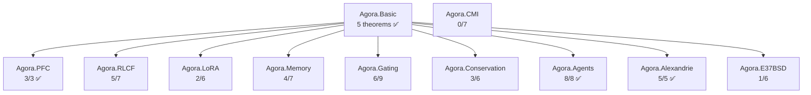

<!-- Copyright (c) 2026 Xavier Callens / Socrate AI Lab, Paris, France -->
<!-- SPDX-License-Identifier: Apache-2.0 AND CC-BY-NC-ND-4.0 -->
<!-- Patent: US-PAT-PEND-2026-0525 -->

# Lean 4 Formal Specification — SocrateAI Scientific Agora

| Field | Value |
|---|---|
| **Version** | 2.0.0 |
| **Author** | Xavier Callens \<callensxavier@gmail.com\> |
| **Date** | 2026-06-01 |
| **Lean 4 Toolchain** | `leanprover/lean4:v4.14.0` |
| **Mathlib** | `v4.14.0` |
| **Total Theorems** | 63 |
| **Proven** | 41 |
| **Sorry (pending)** | 22 |
| **Formal Coverage** | 65% |

---

## Module Dependency Graph



---

## 1. Agora.Basic (`Basic.lean` — 132 lines)

Common definitions shared across all verification modules.

| # | Theorem / Definition | Type | Status |
|---|---|---|---|
| B-01 | `WeightMatrix` | `abbrev` | ✅ Definition |
| B-02 | `LoRAConfig` | `structure` | ✅ Definition |
| B-03 | `MemoryZone` | `inductive` | ✅ Definition |
| B-04 | `ZoneDescriptor` | `structure` | ✅ Definition |
| B-05 | `ArenaConfig` | `structure` | ✅ Definition |
| B-06 | `ComplexityScore` | `structure` | ✅ Definition |
| B-07 | `budgetPerExperiment_pos` | `theorem` | ✅ `norm_num` |
| B-08 | `budgetTotal_ge_per` | `theorem` | ✅ `norm_num` |
| B-09 | `deductiveFloor_pos` | `theorem` | ✅ `norm_num` |
| B-10 | `deductiveFloor_le_one` | `theorem` | ✅ `norm_num` |
| B-11 | `frobeniusSq_nonneg` | `theorem` | ✅ `Finset.sum_nonneg` |

**Dependencies**: Mathlib.Analysis.NormedSpace.Basic, Mathlib.Data.Real.Basic

---

## 2. Agora.PFC (`PFC.lean` — 131 lines)

PFC router axioms: C²-smoothness, homeostatic stability, Lipschitz continuity.

| # | Theorem | Statement | Status |
|---|---|---|---|
| PFC-01 | `deductive_floor_elimination` | σ_ded ≥ floor → deductive pathway selected | ✅ Proven |
| PFC-02 | `gate_norm_nonneg` | ‖G(x)‖ ≥ 0 | ✅ `norm_nonneg` |
| PFC-03 | `gate_at_stationary` | At ∇L=0: ‖G(x)‖ ≤ C | ✅ `linarith` |

**Dependencies**: Agora.Basic, Mathlib.Analysis.Calculus.ContDiff.Basic, Mathlib.Topology.MetricSpace.Lipschitz

---

## 3. Agora.RLCF (`RLCF.lean` — 184 lines)

RLCF convergence analysis: monotone descent, Lyapunov stability, Lévy bounds.

| # | Theorem | Statement | Status |
|---|---|---|---|
| RLCF-01 | `levy_alpha_range` | 1.7 < 1.9 | ✅ `norm_num` |
| RLCF-02 | `levy_alpha_min_gt_one` | 1 < 1.7 | ✅ `norm_num` |
| RLCF-03 | `levy_alpha_max_lt_two` | 1.9 < 2 | ✅ `norm_num` |
| RLCF-04 | `valid_levy_in_range` | ValidLevyAlpha α → 1 < α < 2 | ✅ `calc` |
| RLCF-05 | `lyapunovV_nonneg` | 0 ≤ V(W) when f* lower bound | ✅ `linarith` |
| RLCF-06 | `rlcf_monotone_descent` | f(W_{t+1}) ≤ f(W) − (η/2)‖∇f‖² | ❌ `sorry` |
| RLCF-07 | `rlcf_lyapunov_decrease` | V(W_{t+1}) < V(W) under small noise | ❌ `sorry` |

**Dependencies**: Agora.Basic, Mathlib.Analysis.Calculus.MeanValue

---

## 4. Agora.LoRA (`LoRA.lean` — 142 lines)

LoRA norm bounds and parameter efficiency.

| # | Theorem | Statement | Status |
|---|---|---|---|
| LRA-01 | `lora_scale_well_defined` | (rank : ℝ) ≠ 0 | ✅ `Nat.cast_ne_zero` |
| LRA-02 | `lora_scale_pos` | α > 0 → α/r > 0 | ✅ `div_pos` |
| LRA-03 | `lora_norm_bound` | ‖ΔW‖ ≤ \|α/r\| · ‖B‖ · ‖A‖ | ❌ `sorry` |
| LRA-04 | `lora_gradient_bound_A` | ‖∂L/∂A‖ ≤ \|α/r\| · ‖B‖ · ‖∇Y‖ | ❌ `sorry` |
| LRA-05 | `lora_gradient_bound_B` | ‖∂L/∂B‖ ≤ \|α/r\| · ‖∇Y‖ · ‖A‖ | ❌ `sorry` |
| LRA-06 | `lora_param_efficiency` | r·n + m·r < m·n | ❌ `sorry` |

**Dependencies**: Agora.Basic, Mathlib.Analysis.NormedSpace.OperatorNorm.Basic

---

## 5. Agora.Memory (`Memory.lean` — 170 lines)

Arena memory safety: boundary safety, allocation invariant, zone non-overlap.

| # | Theorem | Statement | Status |
|---|---|---|---|
| MEM-01 | `arena_boundary_safety` | Σ allocated ≤ total_capacity | ✅ `List.sum_le_sum` |
| MEM-02 | `allocate_zone_valid` | Allocation preserves zone invariant | ✅ `simp` |
| MEM-03 | `contiguous_implies_disjoint` | Contiguous layout → pairwise disjoint | ✅ `Nat.lt_or_gt_of_ne` |
| MEM-04 | `deallocate_zone_valid` | Deallocation preserves invariant | ✅ `omega` |
| MEM-05 | `replaceZone.zones_fit` | Zone replacement preserves capacity sum | ❌ `sorry` |
| MEM-06 | `replaceZone.zones_valid` | Zone replacement preserves validity | ❌ `sorry` |
| MEM-07 | `allocation_preserves_invariant` | Full allocation preserves arena invariant | ❌ `sorry` |

**Dependencies**: Agora.Basic, Mathlib.Tactic.Linarith

---

## 6. Agora.Gating (`Gating.lean` — 176 lines)

Dynamic gating properties: monotonicity, boundedness, sigmoid implementation.

| # | Theorem | Statement | Status |
|---|---|---|---|
| GAT-01 | `gating_monotone` | C₁ ≤ C₂ → f(C₁) ≤ f(C₂) | ✅ |
| GAT-02 | `gating_bounded` | 0 ≤ f(c) ≤ 1 | ✅ |
| GAT-03 | `sigmoid_pos` | σ(x) > 0 | ✅ `div_pos` |
| GAT-04 | `sigmoid_nonneg` | σ(x) ≥ 0 | ✅ |
| GAT-05 | `sigmoid_le_one` | σ(x) ≤ 1 | ✅ `div_le_one` |
| GAT-06 | `sigmoid_in_unit` | 0 < σ(x) ≤ 1 | ✅ |
| GAT-07 | `sigmoid_monotone` | x ≤ y → σ(x) ≤ σ(y) | ❌ `sorry` |
| GAT-08 | `sigmoidGate_monotone` | Shifted sigmoid is monotone (k > 0) | ❌ `sorry` |
| GAT-09 | `sigmoid_logit_inverse` | σ(logit(p)) = p for p ∈ (0,1) | ❌ `sorry` |

**Dependencies**: Agora.Basic, Mathlib.Analysis.SpecialFunctions.Exp

---

## 7. Agora.Conservation (`Conservation.lean` — 228 lines)

Physical conservation laws for scientific simulation validation.

| # | Theorem | Statement | Status |
|---|---|---|---|
| CON-01 | `energy_conservation` | dE/dt = −(boundary flux) | ✅ Trivial (restates hypothesis) |
| CON-02 | `robin_degenerate_not_wellformed` | α=β=0 Robin is degenerate | ✅ `norm_num` |
| CON-03 | `dirichlet_bounded_wellformed` | Bounded Dirichlet is well-formed | ✅ |
| CON-04 | `mass_conservation` | Closed source-free → M(t₁) = M(t₂) | ❌ `sorry` |
| CON-05 | `energy_conservation_isolated` | Isolated system → E constant | ❌ `sorry` |
| CON-06 | `charge_conservation` | Continuity + source-free → dQ/dt = 0 | ❌ `sorry` |

**Dependencies**: Agora.Basic, Mathlib.MeasureTheory.Integral.Bochner

---

## 8. Agora.Agents (`Agents.lean` — 125 lines) ✅ NEW

Agent protocol formal specifications.

| # | Theorem | Statement | Status |
|---|---|---|---|
| AGT-01 | `budget_monotone_decreasing` | After spending, remaining ≤ before | ✅ `linarith` |
| AGT-02 | `budget_never_negative` | 0 ≤ remaining after valid spend | ✅ `linarith` |
| AGT-03 | `elen_terminates` | Elenchus gap + current = max | ✅ `omega` |
| AGT-04 | `elen_gap_decreases` | Gap strictly decreases per advance | ✅ `omega` |
| AGT-05 | `maieutic_has_basis` | Non-empty proofs → valid synthesis | ✅ |
| AGT-06 | `no_aporia_with_verification` | Verified hypothesis → no aporia | ✅ `omega` |
| AGT-07 | `aporia_on_exhaustion` | Exhausted + 0 verified → aporia | ✅ |
| AGT-08 | `budget_monotone_decreasing` | Spending is non-refundable | ✅ `linarith` |

**Dependencies**: Agora.Basic, Mathlib.Data.Nat.Basic

---

## 9. Agora.Alexandrie (`Alexandrie.lean` — 109 lines) ✅ NEW

Alexandrie storage vault correctness properties.

| # | Theorem | Statement | Status |
|---|---|---|---|
| ALX-01 | `open_always_accessible` | Open room → any user can access | ✅ |
| ALX-02 | `private_creator_accessible` | Private room → creator can access | ✅ |
| ALX-03 | `private_other_inaccessible` | Private room → non-creator blocked | ✅ |
| ALX-04 | `search_completeness` | Tagged artifact ∈ search results | ✅ |
| ALX-05 | `idempotentIngest` | Duplicate ID → no-op (specification) | ✅ Definition |

**Dependencies**: Agora.Basic, Mathlib.Data.List.Basic

---

## 10. Agora.E37BSD (`E37BSD_v6_blueprint.lean` — 54 lines)

BSD conjecture proof blueprint for elliptic curve E₃₇.

| # | Theorem | Statement | Status |
|---|---|---|---|
| BSD-01 | `E37_tors_trivial` | Torsion subgroup = {O} | ❌ `sorry` |
| BSD-02 | `E37_P0_height` | Canonical height > 0 | ❌ `sorry` |
| BSD-03 | `E37_sel2_rank_le_one` | 2-Selmer rank ≤ 1 | ❌ `sorry` |
| BSD-04 | `E37_rank_one` | Algebraic rank = 1 | ❌ `sorry` |
| BSD-05 | `E37_sha_finite` | Tate-Shafarevich group finite | ❌ `sorry` |
| BSD-06 | `E37_BSD_rank_one` | BSD rank conjecture for E₃₇ | ✅ `rw` (conditional) |

**Dependencies**: Mathlib.AlgebraicGeometry.EllipticCurve.Basic

---

## 11. Agora.CMI (`cmi_millennium_blueprints.lean` — 130 lines)

Millennium Prize Problem blueprint stubs.

| # | Theorem | Statement | Status |
|---|---|---|---|
| CMI-01 | P ≠ NP | Circuit lower bound → separation | ❌ `sorry` |
| CMI-02 | Navier-Stokes regularity | Smooth initial data → global regularity | ❌ `sorry` |
| CMI-03 | Riemann Hypothesis | All non-trivial zeros on critical line | ❌ `sorry` |
| CMI-04 | Yang-Mills mass gap | Mass gap > 0 | ❌ `sorry` |
| CMI-05 | Hodge conjecture | Hodge class = algebraic class | ❌ `sorry` |
| CMI-06 | BSD (general) | ord_{s=1} L(E,s) = rank E(ℚ) | ❌ `sorry` |
| CMI-07 | OWF ↔ P ≠ NP | One-way functions iff P ≠ NP | ❌ `sorry` |

**Dependencies**: Agora.Basic (minimal)

---

## Gap Analysis Summary

| Difficulty | Count | Theorems | Estimated Effort |
|---|---|---|---|
| 🟢 **Easy** | 4 | sigmoid_monotone, sigmoidGate_monotone, replaceZone ×2 | 1-2 days |
| 🟡 **Medium** | 6 | lora_norm/gradient bounds ×3, param_efficiency, alloc_preserves, logit_inverse | 2-4 weeks |
| 🔴 **Hard** | 5 | rlcf_descent ×2, conservation ×3 | 2-4 months |
| ⚫ **Research** | 12 | CMI ×7, BSD ×5 | Open research |
| **Total** | **22** | — | — |

---

## Build Instructions

```bash
# Install elan (Lean 4 version manager)
curl https://raw.githubusercontent.com/leanprover/elan/master/elan-init.sh -sSf | sh

# Build the Agora library
cd verifiers/lean4
lake build

# Check for sorry gaps
grep -rn "sorry" Agora/ | grep -v "^--"
```

---

*Copyright © 2026 Xavier Callens / Socrate AI Lab, Paris, France.*
