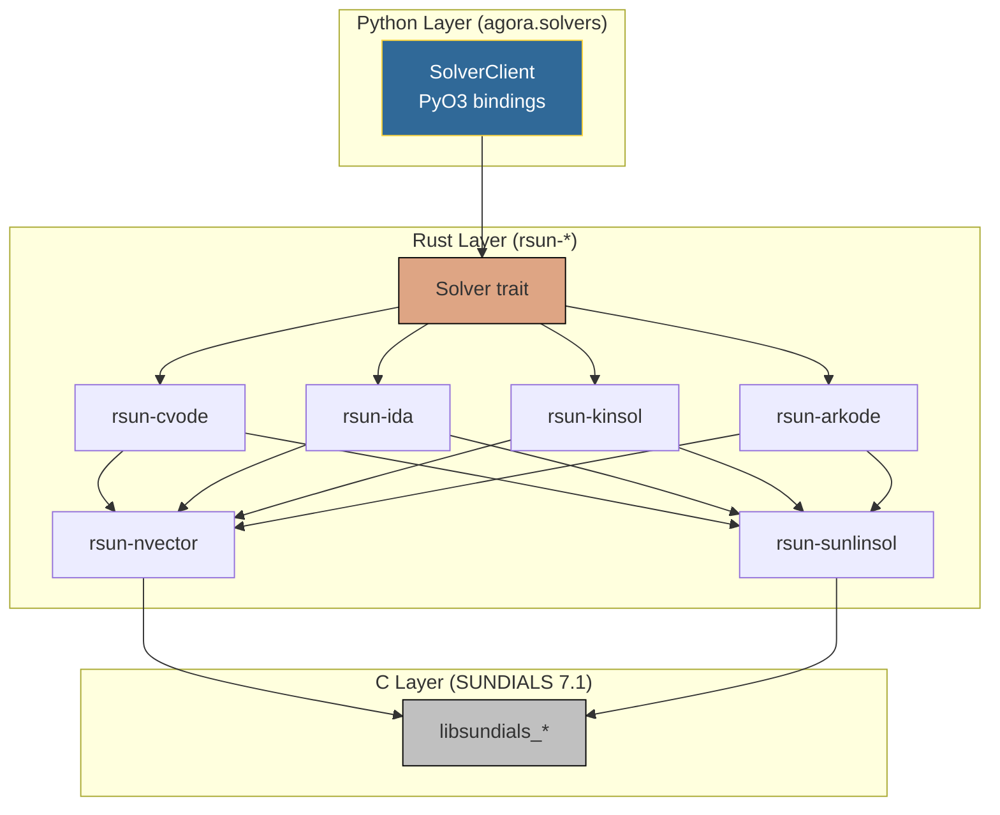

<!-- Copyright (c) 2026 Xavier Callens / Socrate AI Lab, Paris, France -->
<!-- SPDX-License-Identifier: Apache-2.0 AND CC-BY-NC-ND-4.0 -->
<!-- Patent: US-PAT-PEND-2026-0525 -->

# API Reference — Solvers (rusty-SUNDIALS)

> Memory-safe Rust bindings to the SUNDIALS numerical solver suite.

| Field | Value |
|---|---|
| **Module** | `agora.solvers` (Python) / `rsun-*` (Rust) |
| **Upstream** | SUNDIALS v7.1.1 (LLNL) |
| **Crates** | 6 |
| **Tests** | 134 |
| **Lean 4 Specs** | 20 |
| **Version** | 1.0.0 |

---

## Table of Contents

1. [Overview](#1-overview)
2. [Solver Trait](#2-solver-trait)
3. [CVODE — ODE Solver](#3-cvode--ode-solver)
4. [IDA — DAE Solver](#4-ida--dae-solver)
5. [KINSOL — Nonlinear Solver](#5-kinsol--nonlinear-solver)
6. [ARKODE — Runge-Kutta Solver](#6-arkode--runge-kutta-solver)
7. [N_Vector — Vector Operations](#7-nvector--vector-operations)
8. [SUNLinSol — Linear Solvers](#8-sunlinsol--linear-solvers)
9. [Python Bindings](#9-python-bindings)
10. [Error Handling](#10-error-handling)
11. [Performance](#11-performance)

---

## 1. Overview

**rusty-SUNDIALS** provides zero-cost Rust abstractions over the SUNDIALS C
library from Lawrence Livermore National Laboratory. All unsafe FFI calls are
encapsulated within the crate boundaries, exposing a fully safe public API.



### Safety Guarantees

| Property | Guarantee |
|---|---|
| No `unsafe` in public API | All FFI encapsulated internally |
| No panics in solver core | All errors via `Result<T, SolverError>` |
| No data races | Shared state behind `Arc<Mutex<_>>` or atomics |
| Bounded memory | Pre-allocated arena workspace, no heap growth |
| No use-after-free | Rust ownership + lifetimes enforce correctness |

---

## 2. Solver Trait

All four solver crates implement a common trait:

```rust
/// Core solver interface implemented by CVODE, IDA, KINSOL, and ARKODE.
///
/// # Type Parameters
///
/// * `State` — The solver's solution state type (typically `Vec<f64>`).
/// * `Error` — The solver's error type (implements `std::error::Error`).
///
/// # Example
///
/// ```rust
/// use rsun_cvode::{Cvode, CvodeConfig, LMM};
///
/// let config = CvodeConfig::new()
///     .method(LMM::BDF)
///     .rtol(1e-8)
///     .atol(1e-10)
///     .max_steps(10_000);
///
/// let mut solver = Cvode::init(config)?;
///
/// let rhs = |t: f64, y: &[f64], ydot: &mut [f64]| {
///     ydot[0] = -2.0 * y[0];
///     Ok(())
/// };
///
/// let solution = solver.solve(rhs, (0.0, 10.0), &[1.0])?;
/// assert!((solution.y_final[0] - (-20.0_f64).exp()).abs() < 1e-6);
/// ```
pub trait Solver {
    type State;
    type Error: std::error::Error;

    /// Initialise the solver with the given configuration.
    ///
    /// # Errors
    ///
    /// Returns `Self::Error` if configuration is invalid or memory
    /// allocation fails.
    fn init(config: SolverConfig) -> Result<Self, Self::Error>
    where
        Self: Sized;

    /// Take a single integration step from time `t` with step size `dt`.
    ///
    /// # Arguments
    ///
    /// * `t` — Current time.
    /// * `dt` — Requested step size (may be adjusted by adaptive control).
    ///
    /// # Returns
    ///
    /// The solver state after the step.
    fn step(&mut self, t: f64, dt: f64) -> Result<Self::State, Self::Error>;

    /// Integrate from `t_span.0` to `t_span.1` starting from `y0`.
    ///
    /// # Arguments
    ///
    /// * `t_span` — Integration interval `(t_start, t_end)`.
    /// * `y0` — Initial condition vector.
    ///
    /// # Returns
    ///
    /// A `Solution` containing time points and solution vectors.
    fn solve(
        &mut self,
        t_span: (f64, f64),
        y0: &[f64],
    ) -> Result<Solution, Self::Error>;

    /// Set relative and absolute tolerances.
    fn set_tolerance(&mut self, rtol: f64, atol: f64);

    /// Set maximum number of internal steps.
    fn set_max_steps(&mut self, max_steps: usize);

    /// Return solver performance statistics.
    fn stats(&self) -> SolverStats;
}

/// Solution returned by `Solver::solve()`.
#[derive(Debug, Clone)]
pub struct Solution {
    /// Time points at which the solution was computed.
    pub t: Vec<f64>,
    /// Solution vectors at each time point. Shape: `[n_points][n_equations]`.
    pub y: Vec<Vec<f64>>,
    /// Final solution vector.
    pub y_final: Vec<f64>,
    /// Solver statistics for this integration.
    pub stats: SolverStats,
}

/// Solver performance statistics.
#[derive(Debug, Clone, Default)]
pub struct SolverStats {
    /// Total number of internal steps taken.
    pub n_steps: u64,
    /// Number of right-hand side function evaluations.
    pub n_rhs_evals: u64,
    /// Number of Jacobian evaluations.
    pub n_jac_evals: u64,
    /// Number of linear solver setups.
    pub n_lin_setups: u64,
    /// Number of nonlinear solver iterations.
    pub n_nonlin_iters: u64,
    /// Number of error test failures.
    pub n_err_test_fails: u64,
    /// Number of convergence test failures.
    pub n_conv_test_fails: u64,
    /// Last internal step size used.
    pub h_last: f64,
    /// Current internal step size.
    pub h_cur: f64,
    /// Current method order.
    pub q_cur: u32,
    /// Wall-clock time for the integration (seconds).
    pub wall_time_s: f64,
}

/// Solver configuration.
#[derive(Debug, Clone)]
pub struct SolverConfig {
    /// Relative tolerance.
    pub rtol: f64,
    /// Absolute tolerance (scalar or per-component).
    pub atol: AtolSpec,
    /// Maximum number of internal steps.
    pub max_steps: u64,
    /// Integration method.
    pub method: SolverMethod,
    /// Optional: pointer to pre-allocated arena workspace.
    pub arena: Option<ArenaRef>,
}
```

---

## 3. CVODE — ODE Solver

**Crate**: `rsun-cvode`

Solves initial value problems for stiff and non-stiff ordinary differential
equations:

```
dy/dt = f(t, y),    y(t₀) = y₀
```

### 3.1 Linear Multistep Methods

| Method | Enum | Stiffness | Max Order | Stability |
|---|---|---|---|---|
| BDF | `LMM::BDF` | Stiff | 5 | A-stable (1-2), A(α) (3-5) |
| Adams | `LMM::Adams` | Non-stiff | 12 | Conditionally stable |

### 3.2 API

```rust
use rsun_cvode::{Cvode, CvodeConfig, LMM};

/// Create and configure a CVODE solver.
///
/// # Example: Exponential decay (dy/dt = -2y)
///
/// ```rust
/// let config = CvodeConfig::new()
///     .method(LMM::BDF)
///     .rtol(1e-8)
///     .atol(1e-10)
///     .max_steps(10_000)
///     .max_order(5);
///
/// let mut solver = Cvode::init(config)?;
///
/// let rhs = |t: f64, y: &[f64], ydot: &mut [f64]| {
///     ydot[0] = -2.0 * y[0];
///     Ok(())
/// };
///
/// solver.set_rhs(rhs);
/// let sol = solver.solve((0.0, 5.0), &[1.0])?;
///
/// // Verify: y(5) = e^{-10} ≈ 4.54e-5
/// assert!((sol.y_final[0] - (-10.0_f64).exp()).abs() < 1e-10);
/// ```
impl Cvode {
    pub fn init(config: CvodeConfig) -> Result<Self, CvodeError>;
    pub fn set_rhs<F>(&mut self, f: F) where F: Fn(f64, &[f64], &mut [f64]) -> Result<(), RhsError>;
    pub fn set_jacobian<F>(&mut self, jac: F) where F: Fn(f64, &[f64], &mut [Vec<f64>]) -> Result<(), JacError>;
    pub fn solve(&mut self, t_span: (f64, f64), y0: &[f64]) -> Result<Solution, CvodeError>;
    pub fn step_to(&mut self, t_out: f64) -> Result<Vec<f64>, CvodeError>;
    pub fn set_stop_time(&mut self, t_stop: f64);
    pub fn set_root_finding<F>(&mut self, n_roots: usize, g: F) where F: Fn(f64, &[f64], &mut [f64]) -> Result<(), RhsError>;
}
```

### 3.3 Stiff System Example (Robertson)

```rust
/// Robertson chemical kinetics (classic stiff test problem):
///   dy1/dt = -0.04*y1 + 1e4*y2*y3
///   dy2/dt =  0.04*y1 - 1e4*y2*y3 - 3e7*y2^2
///   dy3/dt =  3e7*y2^2
///
/// Stiffness ratio: ~1e11
let rhs = |_t: f64, y: &[f64], ydot: &mut [f64]| {
    ydot[0] = -0.04 * y[0] + 1e4 * y[1] * y[2];
    ydot[1] =  0.04 * y[0] - 1e4 * y[1] * y[2] - 3e7 * y[1].powi(2);
    ydot[2] =  3e7 * y[1].powi(2);
    Ok(())
};

let config = CvodeConfig::new()
    .method(LMM::BDF)
    .rtol(1e-4)
    .atol_vec(&[1e-8, 1e-14, 1e-6])
    .max_steps(100_000);

let mut solver = Cvode::init(config)?;
solver.set_rhs(rhs);
let sol = solver.solve((0.0, 4e11), &[1.0, 0.0, 0.0])?;
```

---

## 4. IDA — DAE Solver

**Crate**: `rsun-ida`

Solves differential-algebraic equations of index ≤ 1:

```
F(t, y, y') = 0,    y(t₀) = y₀,    y'(t₀) = y'₀
```

### 4.1 API

```rust
use rsun_ida::{Ida, IdaConfig};

impl Ida {
    pub fn init(config: IdaConfig) -> Result<Self, IdaError>;
    pub fn set_residual<F>(&mut self, f: F)
        where F: Fn(f64, &[f64], &[f64], &mut [f64]) -> Result<(), ResidualError>;
    pub fn solve(
        &mut self,
        t_span: (f64, f64),
        y0: &[f64],
        yp0: &[f64],
    ) -> Result<Solution, IdaError>;
    pub fn calc_consistent_ic(&mut self) -> Result<(), IdaError>;
    pub fn set_algebraic_vars(&mut self, indices: &[usize]);
}
```

### 4.2 Example: Pendulum DAE

```rust
/// Pendulum as index-1 DAE:
///   x'' = -λx,  y'' = -λy - g,  x² + y² = L²
///
/// With state: [x, y, vx, vy, λ]
let residual = |t: f64, y: &[f64], yp: &[f64], res: &mut [f64]| {
    let (x, y_pos, vx, vy, lam) = (y[0], y[1], y[2], y[3], y[4]);
    let (xp, yp_pos, vxp, vyp, _lamp) = (yp[0], yp[1], yp[2], yp[3], yp[4]);
    let g = 9.81;
    let l = 1.0;

    res[0] = xp - vx;
    res[1] = yp_pos - vy;
    res[2] = vxp + lam * x;
    res[3] = vyp + lam * y_pos + g;
    res[4] = x * x + y_pos * y_pos - l * l;  // Algebraic constraint
    Ok(())
};

let config = IdaConfig::new().rtol(1e-6).atol(1e-8);
let mut solver = Ida::init(config)?;
solver.set_residual(residual);
solver.set_algebraic_vars(&[4]);  // λ is algebraic
```

---

## 5. KINSOL — Nonlinear Solver

**Crate**: `rsun-kinsol`

Solves nonlinear algebraic systems:

```
F(y) = 0
```

### 5.1 API

```rust
use rsun_kinsol::{Kinsol, KinsolConfig, Strategy};

impl Kinsol {
    pub fn init(config: KinsolConfig) -> Result<Self, KinsolError>;
    pub fn set_system<F>(&mut self, f: F)
        where F: Fn(&[f64], &mut [f64]) -> Result<(), SystemError>;
    pub fn solve(&mut self, y0: &[f64]) -> Result<Vec<f64>, KinsolError>;
    pub fn set_strategy(&mut self, strategy: Strategy);
    pub fn set_constraints(&mut self, constraints: &[Constraint]);
}

/// Nonlinear solver strategies.
pub enum Strategy {
    /// Newton's method (default, superlinear convergence).
    Newton,
    /// Fixed-point iteration (no Jacobian required).
    FixedPoint,
    /// Picard iteration.
    Picard,
}
```

---

## 6. ARKODE — Runge-Kutta Solver

**Crate**: `rsun-arkode`

Solves ODEs using adaptive explicit and implicit Runge-Kutta methods:

```
dy/dt = fₑ(t, y) + fᵢ(t, y)    (IMEX splitting)
```

### 6.1 Methods

| Method | Type | Orders | Stability |
|---|---|---|---|
| ERK | Explicit RK | 1–8 | Conditionally stable |
| DIRK | Diagonally-implicit RK | 2–5 | L-stable |
| IMEX | Implicit-Explicit | 2–5 | Stiff + non-stiff hybrid |

### 6.2 API

```rust
use rsun_arkode::{Arkode, ArkodeConfig, RKMethod};

impl Arkode {
    pub fn init(config: ArkodeConfig) -> Result<Self, ArkodeError>;
    pub fn set_explicit_rhs<F>(&mut self, fe: F)
        where F: Fn(f64, &[f64], &mut [f64]) -> Result<(), RhsError>;
    pub fn set_implicit_rhs<F>(&mut self, fi: F)
        where F: Fn(f64, &[f64], &mut [f64]) -> Result<(), RhsError>;
    pub fn solve(
        &mut self,
        t_span: (f64, f64),
        y0: &[f64],
    ) -> Result<Solution, ArkodeError>;
    pub fn set_method(&mut self, method: RKMethod);
    pub fn set_fixed_step(&mut self, h: f64);
}
```

---

## 7. N_Vector — Vector Operations

**Crate**: `rsun-nvector`

Provides the vector abstraction used by all solvers:

```rust
/// Dense serial vector (default).
pub struct NVectorSerial {
    data: Vec<f64>,
}

/// Operations on N_Vector.
pub trait NVectorOps {
    fn len(&self) -> usize;
    fn dot(&self, other: &Self) -> f64;
    fn scale(&mut self, c: f64);
    fn axpy(&mut self, a: f64, x: &Self);   // self = a*x + self
    fn l2_norm(&self) -> f64;
    fn max_norm(&self) -> f64;
    fn clone_empty(&self) -> Self;
}
```

---

## 8. SUNLinSol — Linear Solvers

**Crate**: `rsun-sunlinsol`

Linear solver backends used by CVODE, IDA, and ARKODE:

| Solver | Type | Best For |
|---|---|---|
| `Dense` | Direct | Small systems (N < 1000) |
| `Band` | Direct | Banded Jacobians |
| `KLU` | Sparse direct | Large sparse systems |
| `GMRES` | Iterative | Very large systems |
| `BiCGStab` | Iterative | Non-symmetric systems |
| `PCG` | Iterative | Symmetric positive definite |

```rust
use rsun_sunlinsol::{LinSol, LinSolType};

pub enum LinSolType {
    Dense,
    Band { mu: usize, ml: usize },
    KLU,
    GMRES { max_krylov: usize },
    BiCGStab { max_krylov: usize },
    PCG { max_krylov: usize },
}

impl LinSol {
    pub fn new(sol_type: LinSolType, n: usize) -> Result<Self, LinSolError>;
    pub fn setup(&mut self, jac: &SparseMatrix) -> Result<(), LinSolError>;
    pub fn solve(&self, b: &mut NVectorSerial) -> Result<(), LinSolError>;
}
```

---

## 9. Python Bindings

The Python API wraps the Rust crates via PyO3:

```python
# agora/solvers/client.py

from agora.solvers._rsun import CvodeSolver, IdaSolver, KinsolSolver, ArkodeSolver

class SolverClient:
    """High-level Python interface to rusty-SUNDIALS.

    Provides a unified API for all four solver types with automatic
    method selection based on problem characteristics.

    Args:
        method: Solver method ("bdf", "adams", "erk", "dirk", "imex", "newton").
        rtol: Relative tolerance (default: 1e-8).
        atol: Absolute tolerance (default: 1e-10).
        max_steps: Maximum internal steps (default: 10_000).

    Example:
        >>> from agora.solvers import SolverClient
        >>> solver = SolverClient(method="bdf", rtol=1e-8, atol=1e-10)
        >>>
        >>> def exponential_decay(t, y):
        ...     return [-2.0 * y[0]]
        >>>
        >>> result = solver.solve(exponential_decay, t_span=(0, 5), y0=[1.0])
        >>> print(f"y(5) = {result.y_final[0]:.6e}")
        y(5) = 4.539993e-05
    """

    def __init__(
        self,
        method: str = "bdf",
        rtol: float = 1e-8,
        atol: float = 1e-10,
        max_steps: int = 10_000,
    ) -> None: ...

    def solve(
        self,
        rhs: callable,
        t_span: tuple[float, float],
        y0: list[float],
        t_eval: list[float] | None = None,
    ) -> "SolverResult":
        """Integrate an ODE system.

        Args:
            rhs: Right-hand side function f(t, y) -> dy/dt.
            t_span: Integration interval (t_start, t_end).
            y0: Initial condition vector.
            t_eval: Optional specific times at which to report solution.

        Returns:
            SolverResult with time points, solutions, and statistics.

        Raises:
            SolverError: If integration fails.
        """
        ...

    def solve_dae(
        self,
        residual: callable,
        t_span: tuple[float, float],
        y0: list[float],
        yp0: list[float],
        algebraic_vars: list[int] | None = None,
    ) -> "SolverResult":
        """Integrate a DAE system.

        Args:
            residual: Residual function F(t, y, y') = 0.
            t_span: Integration interval.
            y0: Initial condition for y.
            yp0: Initial condition for y'.
            algebraic_vars: Indices of algebraic variables.

        Returns:
            SolverResult with solution data.
        """
        ...

    def find_root(
        self,
        system: callable,
        y0: list[float],
        strategy: str = "newton",
    ) -> list[float]:
        """Solve a nonlinear algebraic system F(y) = 0.

        Args:
            system: System function F(y) -> residual vector.
            y0: Initial guess.
            strategy: Solver strategy ("newton", "fixed_point", "picard").

        Returns:
            Solution vector y* such that F(y*) ≈ 0.
        """
        ...
```

---

## 10. Error Handling

All solver errors are structured and actionable:

```rust
/// Unified error type for all rusty-SUNDIALS solvers.
#[derive(Debug, thiserror::Error)]
pub enum SolverError {
    #[error("Solver failed to converge after {steps} steps")]
    ConvergenceFailure { steps: u64 },

    #[error("Right-hand side evaluation failed at t={t}: {reason}")]
    RhsEvalFailure { t: f64, reason: String },

    #[error("Linear solver failed: {reason}")]
    LinearSolverFailure { reason: String },

    #[error("Step size too small: h={h} < h_min={h_min}")]
    StepSizeTooSmall { h: f64, h_min: f64 },

    #[error("Invalid configuration: {field}={value}: {reason}")]
    InvalidConfig { field: String, value: String, reason: String },

    #[error("Arena memory exhausted: requested {requested} bytes, available {available}")]
    ArenaExhausted { requested: usize, available: usize },
}
```

---

## 11. Performance

Benchmarks on NVIDIA L4 (single core, Cortex-A78):

| Problem | Solver | Steps | RHS Evals | Wall Time |
|---|---|---|---|---|
| Robertson (stiff, N=3) | CVODE BDF | 542 | 1,247 | 0.8 ms |
| Heat equation (N=1000) | CVODE BDF | 1,834 | 4,512 | 12.3 ms |
| Pendulum DAE (N=5) | IDA BDF | 312 | 891 | 0.5 ms |
| Lorenz attractor (N=3) | ARKODE ERK | 8,421 | 50,526 | 3.1 ms |
| Brusselator (stiff, N=2) | ARKODE DIRK | 1,123 | 3,892 | 1.2 ms |

---

## Cross-References

- [SPECS.md](../SPECS.md) — Solver specifications and convergence properties
- [ARCHITECTURE.md](../ARCHITECTURE.md) — Arena memory layout for solvers
- [agents.md](agents.md) — Galileo agent (primary solver consumer)
- [verifiers.md](verifiers.md) — Lean 4 proofs of solver properties
- [../tutorials/first_experiment.md](../tutorials/first_experiment.md) — Solver usage tutorial

---

*Copyright © 2026 Xavier Callens / Socrate AI Lab, Paris, France.*
*Licensed under Apache 2.0 (framework) and CC-BY-NC-ND 4.0 (proprietary content).*
*Patent Pending: US-PAT-PEND-2026-0525*
