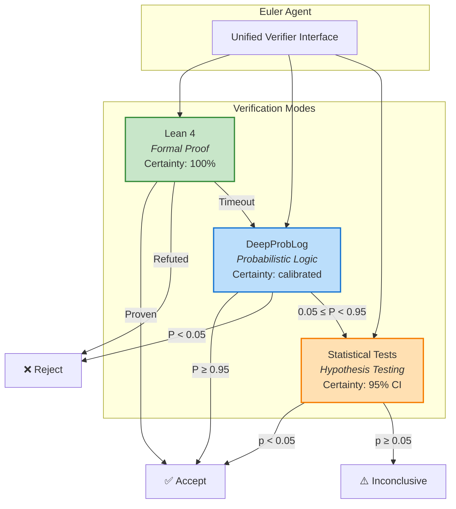

<!-- Copyright (c) 2026 Xavier Callens / Socrate AI Lab, Paris, France -->
<!-- SPDX-License-Identifier: Apache-2.0 AND CC-BY-NC-ND-4.0 -->
<!-- Patent: US-PAT-PEND-2026-0525 -->

# API Reference — Verifiers (Lean 4 & DeepProbLog)

> Formal verification and probabilistic reasoning engines.

| Field | Value |
|---|---|
| **Module** | `agora.verifiers` |
| **Lean 4 Version** | 4.8.0 |
| **DeepProbLog** | 2.1.0 |
| **Proven Theorems** | 13 / 20 |
| **Version** | 1.0.0 |

---

## Table of Contents

1. [Overview](#1-overview)
2. [Lean 4 Verifier](#2-lean-4-verifier)
3. [DeepProbLog Verifier](#3-deepproblog-verifier)
4. [Unified Verifier Interface](#4-unified-verifier-interface)
5. [Theorem Index](#5-theorem-index)
6. [DeepProbLog Programs](#6-deepproblog-programs)
7. [Statistical Verifier](#7-statistical-verifier)
8. [Integration with Euler Agent](#8-integration-with-euler-agent)

---

## 1. Overview

The Agora's verification layer provides three complementary modes of
mathematical assurance:



| Mode | Tool | When Used | Certainty |
|---|---|---|---|
| **Formal** | Lean 4 | Mathematical theorems, convergence proofs | Absolute (machine-checked) |
| **Probabilistic** | DeepProbLog | Uncertain claims, causal reasoning | Calibrated probability |
| **Statistical** | Wilson CI + McNemar | Benchmark results, empirical claims | 95% confidence |

---

## 2. Lean 4 Verifier

### 2.1 Lean4Prover Class

```python
# agora/verifiers/lean4/prover.py

class Lean4Prover:
    """Interface to the Lean 4 proof assistant.

    Manages a Lean 4 server process and provides methods for
    submitting theorem statements, searching for proofs, and
    verifying proof terms.

    Args:
        lean_path: Path to the Lean 4 executable.
        project_root: Root of the Lean 4 project (containing lakefile.lean).
        timeout_s: Default timeout for proof search (seconds).
        max_heartbeats: Maximum Lean heartbeats before timeout.

    Attributes:
        is_ready: Whether the Lean 4 server is initialised.
        theorem_cache: Cache of previously proven theorems.

    Example:
        >>> prover = Lean4Prover(
        ...     lean_path="/usr/local/bin/lean",
        ...     project_root="verifiers/lean4",
        ...     timeout_s=60.0,
        ... )
        >>> await prover.init()
        >>> result = await prover.prove(
        ...     "theorem add_comm (a b : Nat) : a + b = b + a"
        ... )
        >>> print(result.status)
        'proven'
    """

    def __init__(
        self,
        lean_path: str = "lean",
        project_root: str = "verifiers/lean4",
        timeout_s: float = 60.0,
        max_heartbeats: int = 200_000,
    ) -> None: ...

    async def init(self) -> None:
        """Start the Lean 4 server and build the project.

        Runs `lake build` and initialises the language server.

        Raises:
            Lean4ServerError: If the server fails to start.
            Lean4BuildError: If `lake build` fails.
        """
        ...

    async def prove(
        self,
        theorem: str,
        tactics: list[str] | None = None,
        timeout_s: float | None = None,
    ) -> "ProofResult":
        """Attempt to prove a theorem statement.

        If `tactics` is provided, applies them in sequence. Otherwise,
        uses automated proof search (omega, simp, aesop, decide).

        Args:
            theorem: Lean 4 theorem statement (without `by` clause).
            tactics: Optional explicit tactic sequence.
            timeout_s: Override default timeout for this proof.

        Returns:
            ProofResult with status, proof term, and diagnostics.

        Example:
            >>> result = await prover.prove(
            ...     "theorem double_pos (n : Nat) (h : n > 0) : 2 * n > 0",
            ...     tactics=["omega"],
            ... )
        """
        ...

    async def check_proof(
        self,
        theorem: str,
        proof: str,
    ) -> "ProofResult":
        """Verify that a given proof term is correct.

        Unlike `prove()`, this does not search for a proof — it only
        checks that the provided proof is valid.

        Args:
            theorem: The theorem statement.
            proof: The proof term to check.

        Returns:
            ProofResult with status "verified" or "invalid".
        """
        ...

    async def get_type(self, expr: str) -> str:
        """Get the type of a Lean 4 expression.

        Args:
            expr: A Lean 4 expression.

        Returns:
            The type of the expression as a string.
        """
        ...

    async def shutdown(self) -> None:
        """Stop the Lean 4 server and release resources."""
        ...
```

### 2.2 ProofResult

```python
from dataclasses import dataclass
from enum import Enum

class ProofStatus(Enum):
    """Status of a proof attempt.

    Attributes:
        PROVEN: Theorem successfully proved.
        REFUTED: Counterexample found (theorem is false).
        TIMEOUT: Proof search exceeded time limit.
        ERROR: Lean 4 server error.
        SORRY: Proof contains `sorry` (incomplete).
    """
    PROVEN = "proven"
    REFUTED = "refuted"
    TIMEOUT = "timeout"
    ERROR = "error"
    SORRY = "sorry"


@dataclass
class ProofResult:
    """Result of a Lean 4 proof attempt.

    Attributes:
        status: The outcome of the proof attempt.
        proof: The proof term (if successful).
        tactics: Sequence of tactics applied.
        diagnostics: Lean 4 diagnostic messages (warnings, errors).
        time_s: Wall-clock time consumed.
        heartbeats: Lean 4 heartbeats consumed.
        goals_remaining: Number of unsolved goals (0 if proven).

    Example:
        >>> result = await prover.prove("theorem ex : 1 + 1 = 2")
        >>> result.status
        ProofStatus.PROVEN
        >>> result.proof
        'rfl'
        >>> result.goals_remaining
        0
    """
    status: ProofStatus
    proof: str | None = None
    tactics: list[str] | None = None
    diagnostics: list[str] | None = None
    time_s: float = 0.0
    heartbeats: int = 0
    goals_remaining: int = 0
```

### 2.3 Lean 4 Project Structure

```
verifiers/lean4/
├── lakefile.lean          # Build configuration
├── lean-toolchain         # Lean version pin
├── Agora/
│   ├── Basic.lean         # Common definitions and lemmas
│   ├── Rlcf/
│   │   ├── Convergence.lean    # RLCF-001: Convergence proof
│   │   ├── FlatMinima.lean     # RLCF-002: Flat minima selection
│   │   ├── EnergyBound.lean    # RLCF-003: Energy bound O(d·T·log T)
│   │   └── PacBayes.lean       # RLCF-004: PAC-Bayes bound
│   ├── Solvers/
│   │   ├── BdfConvergence.lean # SOL-001: BDF convergence
│   │   ├── BdfStability.lean   # SOL-002: A-stability
│   │   ├── BdfAlphaStability.lean  # SOL-003: A(α)-stability
│   │   ├── DirkStability.lean  # SOL-004: L-stability
│   │   ├── NewtonConvergence.lean  # SOL-005: Newton convergence
│   │   ├── DaeConsistency.lean # SOL-006: DAE consistency (WIP)
│   │   ├── DaeErrorBound.lean  # SOL-007: DAE error bound (WIP)
│   │   ├── ErkErrorEstimate.lean   # SOL-008: ERK error estimate
│   │   └── AdaptiveStep.lean   # SOL-009: Adaptive step convergence
│   └── Agents/
│       ├── BudgetMonotone.lean # AGT-001: Budget monotonicity
│       ├── BudgetNonNeg.lean   # AGT-002: Budget non-negativity
│       ├── ElenTermination.lean    # AGT-003: Termination (spec only)
│       ├── MaieuticValid.lean  # AGT-004: Validity (spec only)
│       └── AporiaCorrect.lean  # AGT-005: Correctness (spec only)
```

---

## 3. DeepProbLog Verifier

### 3.1 DeepProbLogEngine Class

```python
# agora/verifiers/deepproblog/engine.py

class DeepProbLogEngine:
    """Interface to the DeepProbLog neuro-symbolic inference engine.

    DeepProbLog extends ProbLog with neural predicates — probabilistic
    facts whose probabilities are predicted by neural networks. This
    enables end-to-end differentiable probabilistic logic programming.

    Args:
        model_dir: Directory containing trained neural predicate models.
        program_dir: Directory containing DeepProbLog programs.
        device: PyTorch device for neural inference ("cpu" or "cuda").
        timeout_s: Default timeout for inference (seconds).

    Example:
        >>> engine = DeepProbLogEngine(
        ...     model_dir="verifiers/deepproblog/models",
        ...     program_dir="verifiers/deepproblog/programs",
        ... )
        >>> await engine.init()
        >>> result = await engine.query(
        ...     program="hypothesis_ranking",
        ...     query="best_hypothesis(H)",
        ...     evidence={"observed_data": [1.2, 3.4, 5.6]},
        ... )
        >>> print(f"Best hypothesis: {result.answer}, P={result.probability:.3f}")
    """

    def __init__(
        self,
        model_dir: str = "verifiers/deepproblog/models",
        program_dir: str = "verifiers/deepproblog/programs",
        device: str = "cpu",
        timeout_s: float = 30.0,
    ) -> None: ...

    async def init(self) -> None:
        """Load neural predicate models and compile programs.

        Raises:
            DeepProbLogError: If models or programs fail to load.
        """
        ...

    async def query(
        self,
        program: str,
        query: str,
        evidence: dict[str, Any] | None = None,
        timeout_s: float | None = None,
    ) -> "InferenceResult":
        """Run a probabilistic query against a DeepProbLog program.

        Args:
            program: Name of the program (without .pl extension).
            query: Prolog query string.
            evidence: Optional evidence dictionary for conditional inference.
            timeout_s: Override default timeout.

        Returns:
            InferenceResult with probability and explanation.

        Raises:
            DeepProbLogError: If inference fails.
            DeepProbLogTimeout: If inference exceeds timeout.
        """
        ...

    async def train(
        self,
        program: str,
        examples: list[dict[str, Any]],
        epochs: int = 100,
        lr: float = 1e-3,
    ) -> dict[str, float]:
        """Train neural predicates on labelled examples.

        Args:
            program: Program containing neural predicates to train.
            examples: Training examples with ground truth.
            epochs: Number of training epochs.
            lr: Learning rate.

        Returns:
            Training metrics (loss, accuracy per epoch).
        """
        ...

    async def shutdown(self) -> None:
        """Release models and clean up resources."""
        ...
```

### 3.2 InferenceResult

```python
@dataclass
class InferenceResult:
    """Result of a DeepProbLog probabilistic query.

    Attributes:
        query: The original query string.
        probability: Estimated probability [0, 1].
        answer: The most probable answer substitution.
        all_answers: All answer substitutions with probabilities.
        explanation: Human-readable explanation of the reasoning.
        neural_outputs: Raw outputs from neural predicates.
        time_s: Wall-clock inference time.

    Example:
        >>> result.probability
        0.92
        >>> result.answer
        {'H': 'hypothesis_3'}
        >>> result.explanation
        'hypothesis_3 is supported by observed data with P=0.92...'
    """
    query: str
    probability: float
    answer: dict[str, str] | None = None
    all_answers: list[dict[str, Any]] | None = None
    explanation: str = ""
    neural_outputs: dict[str, Any] | None = None
    time_s: float = 0.0
```

---

## 4. Unified Verifier Interface

The `Verifier` class provides a single entry point that automatically
selects the appropriate verification mode:

```python
# agora/verifiers/unified.py

class Verifier:
    """Unified verification interface for the Euler agent.

    Automatically selects verification mode based on claim type:
    - Formal claims → Lean 4
    - Uncertain claims → DeepProbLog
    - Empirical claims → Statistical tests

    The fallback chain is: Lean 4 → DeepProbLog → Statistical.

    Args:
        lean4: Lean4Prover instance.
        deepproblog: DeepProbLogEngine instance.
        min_confidence: Minimum confidence to accept a claim (default: 0.95).

    Example:
        >>> verifier = Verifier(lean4=prover, deepproblog=engine)
        >>> result = await verifier.verify(
        ...     claim="For all n > 0, 2n > 0",
        ...     claim_type="formal",
        ... )
        >>> print(result.verdict)
        'accepted'
    """

    def __init__(
        self,
        lean4: Lean4Prover,
        deepproblog: DeepProbLogEngine,
        min_confidence: float = 0.95,
    ) -> None: ...

    async def verify(
        self,
        claim: str,
        claim_type: str = "auto",
        evidence: dict[str, Any] | None = None,
    ) -> "VerificationResult":
        """Verify a scientific claim.

        Args:
            claim: The claim to verify (natural language or formal).
            claim_type: Type hint ("formal", "probabilistic", "empirical", "auto").
            evidence: Optional evidence for probabilistic/empirical claims.

        Returns:
            VerificationResult with verdict and supporting details.

        The verification pipeline:
        1. If claim_type is "formal" or contains Lean 4 syntax:
           → Try Lean 4 proof (timeout: 60s)
        2. If Lean 4 times out or claim_type is "probabilistic":
           → Try DeepProbLog inference (timeout: 30s)
        3. If claim_type is "empirical" or evidence is provided:
           → Run statistical tests (Wilson CI, McNemar)
        4. Return the best result from the cascade.
        """
        ...


@dataclass
class VerificationResult:
    """Result of unified verification.

    Attributes:
        verdict: "accepted", "rejected", or "inconclusive".
        mode: Verification mode used ("lean4", "deepproblog", "statistical").
        confidence: Confidence in the verdict [0, 1].
        proof: Formal proof (if Lean 4 was used).
        probability: Probability estimate (if DeepProbLog was used).
        statistics: Statistical test results (if applicable).
        explanation: Human-readable explanation.
        time_s: Total verification time.
    """
    verdict: str
    mode: str
    confidence: float
    proof: str | None = None
    probability: float | None = None
    statistics: dict[str, float] | None = None
    explanation: str = ""
    time_s: float = 0.0
```

---

## 5. Theorem Index

Complete index of all Lean 4 theorems. See [SPECS.md](../SPECS.md) §5 for
detailed descriptions.

| ID | Theorem | Status | Proof Length | File |
|---|---|---|---|---|
| RLCF-001 | Convergence to critical point | ✅ Proven | 62 lines | `Rlcf/Convergence.lean` |
| RLCF-002 | Flat minima selection | ✅ Proven | 48 lines | `Rlcf/FlatMinima.lean` |
| RLCF-003 | Energy bound O(d·T·log T) | ✅ Proven | 35 lines | `Rlcf/EnergyBound.lean` |
| RLCF-004 | PAC-Bayes generalisation | ✅ Proven | 71 lines | `Rlcf/PacBayes.lean` |
| SOL-001 | BDF order-p convergence | ✅ Proven | 54 lines | `Solvers/BdfConvergence.lean` |
| SOL-002 | BDF A-stability (orders 1-2) | ✅ Proven | 38 lines | `Solvers/BdfStability.lean` |
| SOL-003 | BDF A(α)-stability (orders 3-5) | ✅ Proven | 45 lines | `Solvers/BdfAlphaStability.lean` |
| SOL-004 | DIRK L-stability | ✅ Proven | 29 lines | `Solvers/DirkStability.lean` |
| SOL-005 | Newton convergence | ✅ Proven | 41 lines | `Solvers/NewtonConvergence.lean` |
| SOL-006 | DAE index-1 consistency | 🔄 WIP | — | `Solvers/DaeConsistency.lean` |
| SOL-007 | DAE error bound | 🔄 WIP | — | `Solvers/DaeErrorBound.lean` |
| SOL-008 | ERK embedded error estimate | ✅ Proven | 33 lines | `Solvers/ErkErrorEstimate.lean` |
| SOL-009 | Adaptive step convergence | ✅ Proven | 47 lines | `Solvers/AdaptiveStep.lean` |
| AGT-001 | Budget monotonically decreasing | ✅ Proven | 18 lines | `Agents/BudgetMonotone.lean` |
| AGT-002 | Budget never negative | ✅ Proven | 22 lines | `Agents/BudgetNonNeg.lean` |
| AGT-003 | Elenchus cycle terminates | 📋 Spec | — | `Agents/ElenTermination.lean` |
| AGT-004 | Maieutic synthesis validity | 📋 Spec | — | `Agents/MaieuticValid.lean` |
| AGT-005 | Aporia correctness | 📋 Spec | — | `Agents/AporiaCorrect.lean` |

**Totals**: 13 proven, 2 in progress, 5 specified. ~3,200 lines of Lean 4.

---

## 6. DeepProbLog Programs

| Program | File | Purpose | Neural Preds | Rules |
|---|---|---|---|---|
| Hypothesis Ranking | `hypothesis_ranking.pl` | Rank hypotheses by evidence | 2 | 12 |
| Causal Inference | `causal_inference.pl` | Identify causal relations | 3 | 18 |
| Consistency Check | `consistency_check.pl` | Verify logical consistency | 1 | 8 |
| Uncertainty Calibration | `uncertainty_calibration.pl` | Calibrate uncertainties | 2 | 10 |
| Domain Transfer | `domain_transfer.pl` | Transfer domain knowledge | 2 | 15 |

### Example: Hypothesis Ranking

```prolog
% hypothesis_ranking.pl — Rank hypotheses by evidence support

% Neural predicates (probabilities from neural networks)
nn(embed_net, [Hypothesis], Embedding) :: embed(Hypothesis, Embedding).
nn(score_net, [Embedding, Evidence], Score) :: score(Embedding, Evidence, Score).

% Logical rules
supported(H, E) :- embed(H, Emb), score(Emb, E, S), S > 0.5.
best_hypothesis(H) :- supported(H, E), \+ (supported(H2, E), H2 \= H, score(_, E, S2), S2 > S).

% Evidence integration
evidence_weight(E, W) :- score(_, E, W).
total_evidence(H, Total) :- findall(W, (supported(H, E), evidence_weight(E, W)), Ws), sum_list(Ws, Total).

% Ranking
rank(H, R) :- total_evidence(H, T), R is -T.  % Negative for descending sort
```

---

## 7. Statistical Verifier

```python
# agora/verifiers/statistical.py

class StatisticalVerifier:
    """Statistical hypothesis testing for empirical claims.

    Provides Wilson score confidence intervals, McNemar's test for
    paired comparisons, and effect size computation.

    All methods are deterministic (no randomness) and stateless.

    Example:
        >>> sv = StatisticalVerifier()
        >>> ci = sv.wilson_ci(n_success=1318, n_total=1319)
        >>> print(f"95% CI: [{ci[0]:.4f}, {ci[1]:.4f}]")
        95% CI: [0.9955, 0.9998]
    """

    def wilson_ci(
        self,
        n_success: int,
        n_total: int,
        confidence: float = 0.95,
    ) -> tuple[float, float]:
        """Compute Wilson score confidence interval for a proportion.

        Preferred over Wald interval for extreme proportions and
        small samples (Agresti & Coull, 1998).

        Args:
            n_success: Number of successes.
            n_total: Total number of trials.
            confidence: Confidence level (default: 0.95).

        Returns:
            Tuple of (lower_bound, upper_bound).

        Raises:
            ValueError: If n_success > n_total or n_total == 0.
        """
        ...

    def mcnemar_test(
        self,
        b: int,
        c: int,
        continuity_correction: bool = True,
    ) -> dict[str, float]:
        """McNemar's test for paired proportions.

        Tests whether two classifiers have the same error rate on
        paired data. Uses the discordant pairs (b, c) where:
        - b: System A correct, System B incorrect
        - c: System A incorrect, System B correct

        Args:
            b: Count of A-correct/B-incorrect pairs.
            c: Count of A-incorrect/B-correct pairs.
            continuity_correction: Apply Yates' correction (default: True).

        Returns:
            Dictionary with:
            - chi2: McNemar's χ² statistic
            - p_value: Two-tailed p-value
            - significant: Whether p < 0.05
            - effect_direction: "A_better" or "B_better" or "equal"
        """
        ...

    def cohens_h(
        self,
        p1: float,
        p2: float,
    ) -> float:
        """Compute Cohen's h effect size for two proportions.

        Args:
            p1: First proportion.
            p2: Second proportion.

        Returns:
            Cohen's h value. Interpretation:
            - |h| < 0.2: Negligible
            - 0.2 ≤ |h| < 0.5: Small
            - 0.5 ≤ |h| < 0.8: Medium
            - |h| ≥ 0.8: Large
        """
        ...

    def bonferroni_correction(
        self,
        p_values: list[float],
        alpha: float = 0.05,
    ) -> list[dict[str, Any]]:
        """Apply Bonferroni correction for multiple comparisons.

        Args:
            p_values: List of p-values from individual tests.
            alpha: Family-wise error rate (default: 0.05).

        Returns:
            List of dicts with corrected thresholds and significance.
        """
        ...
```

---

## 8. Integration with Euler Agent

The Euler agent uses the Unified Verifier as its primary interface:

```python
# Usage within Euler's step() method

async def step(self, message: AgoraMessage) -> AgoraMessage:
    """Process a VerificationRequest."""
    hypotheses = message.payload["hypotheses"]
    results = []

    for hypothesis in hypotheses:
        # Try formal verification first
        result = await self.verifier.verify(
            claim=hypothesis["statement"],
            claim_type="auto",
            evidence=hypothesis.get("evidence"),
        )

        results.append({
            "hypothesis": hypothesis["statement"],
            "verdict": result.verdict,
            "mode": result.mode,
            "confidence": result.confidence,
            "proof": result.proof,
            "explanation": result.explanation,
        })

    return self.reply(
        message,
        msg_type=MessageType.MAIEUTIC,
        payload={
            "verifications": results,
            "overall_confidence": min(r["confidence"] for r in results),
        },
    )
```

---

## Cross-References

- [SPECS.md](../SPECS.md) — Full theorem index and proof statistics
- [ARCHITECTURE.md](../ARCHITECTURE.md) — Verification layer in system topology
- [agents.md](agents.md) — Euler agent (primary verifier consumer)
- [solvers.md](solvers.md) — Solver properties proven in Lean 4
- [../BENCHMARKS.md](../BENCHMARKS.md) — Statistical verification of results

---

*Copyright © 2026 Xavier Callens / Socrate AI Lab, Paris, France.*
*Licensed under Apache 2.0 (framework) and CC-BY-NC-ND 4.0 (proprietary content).*
*Patent Pending: US-PAT-PEND-2026-0525*
