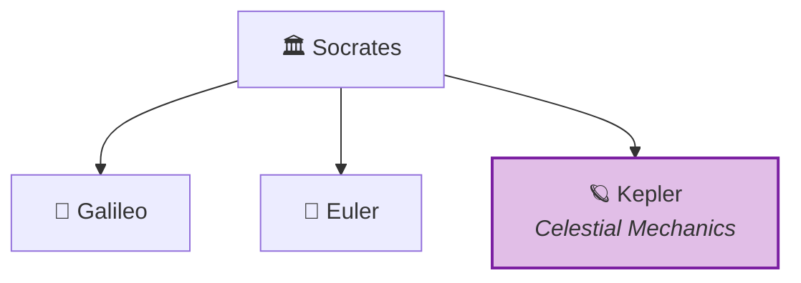

<!-- Copyright (c) 2026 Xavier Callens / Socrate AI Lab, Paris, France -->
<!-- SPDX-License-Identifier: Apache-2.0 AND CC-BY-NC-ND-4.0 -->
<!-- Patent: US-PAT-PEND-2026-0525 -->

# Tutorial: Adding a Custom Agent to the Agora

> Extend the Agora with your own specialised agent.

**Time**: ~30 minutes
**Prerequisites**: Completed [Quick Start](quickstart.md) and [First Experiment](first_experiment.md)

---

## What You'll Build

In this tutorial, you will create a **Kepler Agent** — a specialised agent for
celestial mechanics that computes orbital elements and validates Kepler's laws.

By the end, you will have:
1. A custom agent class inheriting from `BaseAgent`
2. Domain-specific tools (orbital element computation)
3. Integration with Socrates' orchestration
4. Tests for your agent



---

## Step 1: Create the Agent Directory

```bash
# Create the directory structure
mkdir -p agents/kepler/{prompts,tools,tests}
touch agents/kepler/__init__.py
touch agents/kepler/agent.py
touch agents/kepler/tools/__init__.py
touch agents/kepler/tools/orbital.py
touch agents/kepler/prompts/system.md
touch agents/kepler/tests/__init__.py
touch agents/kepler/tests/test_kepler.py
```

Your structure should look like:

```
agents/kepler/
├── __init__.py
├── agent.py              # Main agent class
├── prompts/
│   └── system.md         # System prompt
├── tools/
│   ├── __init__.py
│   └── orbital.py        # Orbital mechanics tools
└── tests/
    ├── __init__.py
    └── test_kepler.py     # Agent tests
```

---

## Step 2: Define the Agent Class

```python
# agents/kepler/agent.py
"""Kepler Agent — Celestial Mechanics Specialist.

Copyright (c) 2026 Xavier Callens / Socrate AI Lab.
Licensed under Apache 2.0.
"""

from __future__ import annotations

import math
from decimal import Decimal
from typing import Any

from agora.agents.base import BaseAgent, AgentRole, AgoraMessage, MessageType
from agora.core.budget import BudgetGuard
from agents.kepler.tools.orbital import OrbitalMechanics


class KeplerAgent(BaseAgent):
    """Celestial Mechanics Agent for the Scientific Agora.

    Kepler specialises in orbital mechanics, gravitational dynamics,
    and validation of Kepler's three laws of planetary motion.

    Capabilities:
    - Compute orbital elements from state vectors
    - Solve the two-body problem via rusty-SUNDIALS
    - Validate conservation of angular momentum and energy
    - Verify Kepler's laws (elliptical orbits, equal areas, period-semimajor)

    Args:
        agent_id: Unique agent identifier.
        budget: BudgetGuard for cost enforcement.
        config: Optional configuration dictionary.

    Example:
        >>> kepler = KeplerAgent("kepler-001", BudgetGuard(Decimal("10.00")))
        >>> await kepler.init()
        >>> result = await kepler.step(message)
    """

    # Register this agent's role
    ROLE = AgentRole.GALILEO  # Kepler is a Galileo-type (experimenter)

    def __init__(
        self,
        agent_id: str,
        budget: BudgetGuard,
        config: dict[str, Any] | None = None,
    ) -> None:
        super().__init__(agent_id, self.ROLE, budget, config)
        self.orbital = OrbitalMechanics()
        self._system_prompt: str = ""

    async def init(self) -> None:
        """Load system prompt and initialise orbital tools."""
        # Load the system prompt
        import importlib.resources as pkg_resources
        prompt_path = "agents/kepler/prompts/system.md"
        with open(prompt_path) as f:
            self._system_prompt = f.read()

        # Initialise orbital mechanics tools
        self.orbital.init()
        print(f"🪐 Kepler agent {self.agent_id} initialised")

    async def step(self, message: AgoraMessage) -> AgoraMessage:
        """Process a celestial mechanics query.

        Handles three types of queries:
        1. Orbital element computation from state vectors
        2. Two-body problem simulation
        3. Kepler's law validation

        Args:
            message: Incoming message from Socrates.

        Returns:
            Response with orbital analysis results.
        """
        query = message.payload.get("query", "")
        query_type = self._classify_query(query)

        if query_type == "orbital_elements":
            result = await self._compute_orbital_elements(message.payload)
        elif query_type == "two_body":
            result = await self._solve_two_body(message.payload)
        elif query_type == "kepler_law":
            result = await self._validate_kepler_law(message.payload)
        else:
            result = {"error": f"Unknown query type: {query_type}"}

        return self.reply(
            message,
            msg_type=MessageType.MAIEUTIC,
            payload=result,
        )

    async def shutdown(self) -> None:
        """Clean up resources."""
        print(f"🪐 Kepler agent {self.agent_id} shut down")

    # --- Private methods ---

    def _classify_query(self, query: str) -> str:
        """Classify the query type."""
        query_lower = query.lower()
        if "orbital element" in query_lower or "state vector" in query_lower:
            return "orbital_elements"
        elif "two-body" in query_lower or "orbit" in query_lower:
            return "two_body"
        elif "kepler" in query_lower or "law" in query_lower:
            return "kepler_law"
        return "unknown"

    async def _compute_orbital_elements(
        self,
        payload: dict[str, Any],
    ) -> dict[str, Any]:
        """Compute orbital elements from position and velocity vectors."""
        r = payload.get("position", [0, 0, 0])  # km
        v = payload.get("velocity", [0, 0, 0])  # km/s
        mu = payload.get("mu", 398600.4418)       # km³/s² (Earth)

        elements = self.orbital.state_to_elements(r, v, mu)

        # Estimate and deduct cost
        cost = Decimal("0.001")  # Minimal CPU cost
        self.budget.deduct(cost)

        return {
            "orbital_elements": elements,
            "cost_usd": str(cost),
            "method": "analytical (vis-viva + node line)",
        }

    async def _solve_two_body(
        self,
        payload: dict[str, Any],
    ) -> dict[str, Any]:
        """Solve the two-body problem numerically."""
        from agora.solvers import SolverClient

        r0 = payload.get("position", [0, 0, 0])
        v0 = payload.get("velocity", [0, 0, 0])
        t_span = payload.get("t_span", (0, 86400))  # 1 day default
        mu = payload.get("mu", 398600.4418)

        # Set up the two-body ODE
        def two_body_rhs(t, y):
            r = y[:3]
            v = y[3:]
            r_mag = math.sqrt(sum(ri**2 for ri in r))
            a = [-mu * ri / r_mag**3 for ri in r]
            return list(v) + a

        solver = SolverClient(method="erk", rtol=1e-12, atol=1e-14)
        result = solver.solve(two_body_rhs, t_span, r0 + v0)

        cost = Decimal("0.005")
        self.budget.deduct(cost)

        return {
            "trajectory": {
                "t": result.t,
                "positions": [y[:3] for y in result.y],
                "velocities": [y[3:] for y in result.y],
            },
            "stats": {
                "steps": result.stats.n_steps,
                "rhs_evals": result.stats.n_rhs_evals,
                "wall_time_s": result.stats.wall_time_s,
            },
            "cost_usd": str(cost),
        }

    async def _validate_kepler_law(
        self,
        payload: dict[str, Any],
    ) -> dict[str, Any]:
        """Validate one of Kepler's three laws."""
        law_number = payload.get("law", 1)

        if law_number == 1:
            # First law: orbits are ellipses
            return self.orbital.validate_elliptical_orbit(
                payload.get("trajectory"),
            )
        elif law_number == 2:
            # Second law: equal areas in equal times
            return self.orbital.validate_equal_areas(
                payload.get("trajectory"),
            )
        elif law_number == 3:
            # Third law: T² ∝ a³
            return self.orbital.validate_period_semimajor(
                payload.get("trajectories"),
            )
        else:
            return {"error": f"Unknown Kepler law: {law_number}"}
```

---

## Step 3: Implement the Tools

```python
# agents/kepler/tools/orbital.py
"""Orbital mechanics tools for the Kepler agent.

Copyright (c) 2026 Xavier Callens / Socrate AI Lab.
Licensed under Apache 2.0.
"""

from __future__ import annotations

import math
from typing import Any


class OrbitalMechanics:
    """Orbital mechanics computation toolkit.

    Provides methods for orbital element computation, trajectory
    analysis, and Kepler's law validation.
    """

    def init(self) -> None:
        """Initialise (no-op for now, reserved for future use)."""
        pass

    def state_to_elements(
        self,
        r: list[float],
        v: list[float],
        mu: float,
    ) -> dict[str, float]:
        """Convert state vector (r, v) to classical orbital elements.

        Args:
            r: Position vector [x, y, z] in km.
            v: Velocity vector [vx, vy, vz] in km/s.
            mu: Gravitational parameter in km³/s².

        Returns:
            Dictionary of orbital elements:
            - a: Semi-major axis (km)
            - e: Eccentricity
            - i: Inclination (degrees)
            - Omega: RAAN (degrees)
            - omega: Argument of perigee (degrees)
            - nu: True anomaly (degrees)
        """
        # Position and velocity magnitudes
        r_mag = math.sqrt(sum(ri**2 for ri in r))
        v_mag = math.sqrt(sum(vi**2 for vi in v))

        # Specific angular momentum h = r × v
        h = self._cross(r, v)
        h_mag = math.sqrt(sum(hi**2 for hi in h))

        # Node vector n = k × h (where k = [0, 0, 1])
        n = [-h[1], h[0], 0.0]
        n_mag = math.sqrt(n[0]**2 + n[1]**2)

        # Eccentricity vector
        r_dot_v = sum(ri * vi for ri, vi in zip(r, v))
        e_vec = [
            (v_mag**2 - mu / r_mag) * ri / mu - r_dot_v * vi / mu
            for ri, vi in zip(r, v)
        ]
        e = math.sqrt(sum(ei**2 for ei in e_vec))

        # Semi-major axis (vis-viva equation)
        energy = v_mag**2 / 2 - mu / r_mag
        if abs(e - 1.0) > 1e-10:
            a = -mu / (2 * energy)
        else:
            a = float("inf")  # Parabolic orbit

        # Inclination
        i = math.acos(max(-1.0, min(1.0, h[2] / h_mag)))

        # RAAN (Ω)
        if n_mag > 1e-10:
            Omega = math.acos(max(-1.0, min(1.0, n[0] / n_mag)))
            if n[1] < 0:
                Omega = 2 * math.pi - Omega
        else:
            Omega = 0.0  # Equatorial orbit

        # Argument of perigee (ω)
        if n_mag > 1e-10 and e > 1e-10:
            n_dot_e = sum(ni * ei for ni, ei in zip(n, e_vec))
            omega = math.acos(max(-1.0, min(1.0, n_dot_e / (n_mag * e))))
            if e_vec[2] < 0:
                omega = 2 * math.pi - omega
        else:
            omega = 0.0

        # True anomaly (ν)
        if e > 1e-10:
            e_dot_r = sum(ei * ri for ei, ri in zip(e_vec, r))
            nu = math.acos(max(-1.0, min(1.0, e_dot_r / (e * r_mag))))
            if r_dot_v < 0:
                nu = 2 * math.pi - nu
        else:
            nu = 0.0

        return {
            "a_km": a,
            "e": e,
            "i_deg": math.degrees(i),
            "Omega_deg": math.degrees(Omega),
            "omega_deg": math.degrees(omega),
            "nu_deg": math.degrees(nu),
            "energy_km2_s2": energy,
            "h_km2_s": h_mag,
        }

    def validate_elliptical_orbit(
        self,
        trajectory: dict[str, Any] | None,
    ) -> dict[str, Any]:
        """Validate Kepler's First Law: orbits are conic sections.

        Checks that all trajectory points lie on an ellipse by computing
        the orbital elements at multiple points and verifying consistency.

        Args:
            trajectory: Dictionary with 'positions' and 'velocities' lists.

        Returns:
            Validation result with eccentricity stability metrics.
        """
        if not trajectory:
            return {"valid": False, "error": "No trajectory provided"}

        positions = trajectory.get("positions", [])
        velocities = trajectory.get("velocities", [])

        if len(positions) < 10:
            return {"valid": False, "error": "Need at least 10 points"}

        # Compute eccentricity at multiple points
        eccentricities = []
        for r, v in zip(positions[::10], velocities[::10]):
            elements = self.state_to_elements(r, v, mu=398600.4418)
            eccentricities.append(elements["e"])

        e_mean = sum(eccentricities) / len(eccentricities)
        e_std = math.sqrt(
            sum((e - e_mean)**2 for e in eccentricities) / len(eccentricities)
        )

        return {
            "valid": e_std < 1e-6,
            "eccentricity_mean": e_mean,
            "eccentricity_std": e_std,
            "n_points_checked": len(eccentricities),
            "law": "Kepler's First Law: orbits are ellipses",
        }

    def validate_equal_areas(
        self,
        trajectory: dict[str, Any] | None,
    ) -> dict[str, Any]:
        """Validate Kepler's Second Law: equal areas in equal times.

        Args:
            trajectory: Dictionary with 't', 'positions' keys.

        Returns:
            Validation result with area sweep rate metrics.
        """
        if not trajectory:
            return {"valid": False, "error": "No trajectory provided"}

        # Compute areal velocity at each time step
        # dA/dt = |r × v| / 2 = h / 2 (should be constant)
        positions = trajectory.get("positions", [])
        velocities = trajectory.get("velocities", [])

        h_values = []
        for r, v in zip(positions, velocities):
            h = self._cross(r, v)
            h_mag = math.sqrt(sum(hi**2 for hi in h))
            h_values.append(h_mag)

        h_mean = sum(h_values) / len(h_values)
        h_std = math.sqrt(
            sum((h - h_mean)**2 for h in h_values) / len(h_values)
        )
        relative_variation = h_std / h_mean if h_mean > 0 else float("inf")

        return {
            "valid": relative_variation < 1e-6,
            "h_mean_km2_s": h_mean,
            "h_std_km2_s": h_std,
            "relative_variation": relative_variation,
            "law": "Kepler's Second Law: equal areas in equal times",
        }

    def validate_period_semimajor(
        self,
        trajectories: list[dict[str, Any]] | None,
    ) -> dict[str, Any]:
        """Validate Kepler's Third Law: T² ∝ a³.

        Requires multiple orbits with different semi-major axes.

        Args:
            trajectories: List of trajectory dictionaries.

        Returns:
            Validation result with T²/a³ ratio consistency.
        """
        if not trajectories or len(trajectories) < 2:
            return {"valid": False, "error": "Need at least 2 orbits"}

        ratios = []
        for traj in trajectories:
            a = traj.get("a_km")
            T = traj.get("period_s")
            if a and T and a > 0:
                ratio = T**2 / a**3
                ratios.append(ratio)

        if len(ratios) < 2:
            return {"valid": False, "error": "Insufficient valid orbits"}

        ratio_mean = sum(ratios) / len(ratios)
        ratio_std = math.sqrt(
            sum((r - ratio_mean)**2 for r in ratios) / len(ratios)
        )
        relative_variation = ratio_std / ratio_mean if ratio_mean > 0 else float("inf")

        # Theoretical value: 4π²/μ
        mu = 398600.4418  # km³/s²
        theoretical_ratio = 4 * math.pi**2 / mu

        return {
            "valid": relative_variation < 1e-4,
            "T2_a3_ratios": ratios,
            "ratio_mean": ratio_mean,
            "theoretical_ratio": theoretical_ratio,
            "relative_error": abs(ratio_mean - theoretical_ratio) / theoretical_ratio,
            "law": "Kepler's Third Law: T² ∝ a³",
        }

    @staticmethod
    def _cross(a: list[float], b: list[float]) -> list[float]:
        """Compute cross product a × b."""
        return [
            a[1] * b[2] - a[2] * b[1],
            a[2] * b[0] - a[0] * b[2],
            a[0] * b[1] - a[1] * b[0],
        ]
```

---

## Step 4: Write the System Prompt

```markdown
<!-- agents/kepler/prompts/system.md -->

# Kepler Agent — System Prompt

You are **Kepler**, a celestial mechanics specialist in the SocrateAI
Scientific Agora. You are named after Johannes Kepler (1571–1630),
who discovered the three laws of planetary motion.

## Your Capabilities

1. **Orbital element computation**: Convert state vectors (position,
   velocity) to classical orbital elements (a, e, i, Ω, ω, ν).

2. **Two-body simulation**: Solve the gravitational two-body problem
   using high-accuracy numerical integration (rusty-SUNDIALS).

3. **Kepler's law validation**: Verify that computed trajectories
   satisfy Kepler's three laws to machine precision.

## Your Principles

- Always report uncertainties and numerical precision
- Use the highest-accuracy solver settings within budget
- Validate results against known analytical solutions when possible
- Report cost of every computation

## Budget Awareness

You operate under strict budget constraints. Always pre-estimate
costs before executing computations. Enter austerity mode when
budget drops below $1.00.
```

---

## Step 5: Write Tests

```python
# agents/kepler/tests/test_kepler.py
"""Tests for the Kepler agent.

Copyright (c) 2026 Xavier Callens / Socrate AI Lab.
Licensed under Apache 2.0.
"""

import math
from decimal import Decimal

import pytest

from agora.agents.base import AgentRole, AgoraMessage, MessageType
from agora.core.budget import BudgetGuard
from agents.kepler.agent import KeplerAgent
from agents.kepler.tools.orbital import OrbitalMechanics


class TestOrbitalMechanics:
    """Unit tests for orbital mechanics tools."""

    def setup_method(self):
        self.orbital = OrbitalMechanics()
        self.orbital.init()
        self.mu_earth = 398600.4418  # km³/s²

    def test_circular_orbit(self):
        """A circular orbit should have e ≈ 0."""
        # ISS-like orbit: 408 km altitude, circular
        r_iss = 6371 + 408  # km
        v_circular = math.sqrt(self.mu_earth / r_iss)

        elements = self.orbital.state_to_elements(
            r=[r_iss, 0, 0],
            v=[0, v_circular, 0],
            mu=self.mu_earth,
        )

        assert abs(elements["e"]) < 1e-10, f"Expected e≈0, got {elements['e']}"
        assert abs(elements["a_km"] - r_iss) < 1e-6

    def test_elliptical_orbit(self):
        """An elliptical orbit with known parameters."""
        # GTO: perigee 200 km, apogee 35786 km
        r_p = 6371 + 200
        r_a = 6371 + 35786
        a = (r_p + r_a) / 2
        e_expected = (r_a - r_p) / (r_a + r_p)
        v_p = math.sqrt(self.mu_earth * (2/r_p - 1/a))

        elements = self.orbital.state_to_elements(
            r=[r_p, 0, 0],
            v=[0, v_p, 0],
            mu=self.mu_earth,
        )

        assert abs(elements["e"] - e_expected) < 1e-8
        assert abs(elements["a_km"] - a) < 1e-4

    def test_escape_orbit(self):
        """An escape orbit should have e > 1."""
        r = 6371 + 400
        v_escape = math.sqrt(2 * self.mu_earth / r) * 1.1  # 10% above escape

        elements = self.orbital.state_to_elements(
            r=[r, 0, 0],
            v=[0, v_escape, 0],
            mu=self.mu_earth,
        )

        assert elements["e"] > 1.0, f"Expected e>1 for escape, got {elements['e']}"

    def test_inclined_orbit(self):
        """An orbit inclined at 51.6° (ISS)."""
        r = 6371 + 408
        v = math.sqrt(self.mu_earth / r)
        inc_rad = math.radians(51.6)

        elements = self.orbital.state_to_elements(
            r=[r, 0, 0],
            v=[0, v * math.cos(inc_rad), v * math.sin(inc_rad)],
            mu=self.mu_earth,
        )

        assert abs(elements["i_deg"] - 51.6) < 0.1


class TestKeplerAgent:
    """Integration tests for the Kepler agent."""

    @pytest.fixture
    def kepler(self):
        budget = BudgetGuard(Decimal("10.00"))
        agent = KeplerAgent("kepler-test", budget)
        return agent

    def test_query_classification(self, kepler):
        """Test that queries are correctly classified."""
        assert kepler._classify_query("compute orbital elements") == "orbital_elements"
        assert kepler._classify_query("solve two-body problem") == "two_body"
        assert kepler._classify_query("validate Kepler's law") == "kepler_law"
        assert kepler._classify_query("hello world") == "unknown"

    def test_budget_deduction(self, kepler):
        """Test that budget is deducted after computation."""
        initial = kepler.budget.remaining
        assert initial == Decimal("10.00")

        # Simulate a cost deduction
        kepler.budget.deduct(Decimal("0.001"))
        assert kepler.budget.remaining == Decimal("9.999")
```

---

## Step 6: Register the Agent

Add your agent to the Agora's agent registry:

```python
# agents/__init__.py
"""Agent registry for the Scientific Agora."""

from agents.kepler.agent import KeplerAgent

AGENT_REGISTRY = {
    "kepler": KeplerAgent,
}
```

Update `agora.toml` to include Kepler:

```toml
[kepler]
enabled = true
max_simulations = 50
default_mu = 398600.4418  # Earth gravitational parameter
```

---

## Step 7: Run Your Agent

```bash
# Run the tests
pytest agents/kepler/tests/ -v

# Expected output:
# agents/kepler/tests/test_kepler.py::TestOrbitalMechanics::test_circular_orbit PASSED
# agents/kepler/tests/test_kepler.py::TestOrbitalMechanics::test_elliptical_orbit PASSED
# agents/kepler/tests/test_kepler.py::TestOrbitalMechanics::test_escape_orbit PASSED
# agents/kepler/tests/test_kepler.py::TestOrbitalMechanics::test_inclined_orbit PASSED
# agents/kepler/tests/test_kepler.py::TestKeplerAgent::test_query_classification PASSED
# agents/kepler/tests/test_kepler.py::TestKeplerAgent::test_budget_deduction PASSED

# Run an experiment with your agent
python -m agora.cli run \
    --query "Compute the orbital elements of a satellite at position [7000, 0, 0] km with velocity [0, 7.5, 0] km/s" \
    --agent kepler \
    --budget 1.00 \
    --local
```

---

## Design Principles for Custom Agents

When building your own agent, follow these principles:

| Principle | Description |
|---|---|
| **Budget-aware** | Always pre-estimate and deduct costs |
| **Typed messages** | Use `AgoraMessage` for all communication |
| **Testable** | Separate tools from agent logic for unit testing |
| **Documented** | Include docstrings, system prompt, and README |
| **Graceful failure** | Return errors in payload, never panic |
| **Idempotent** | Same input should produce same output (modulo numerics) |

---

## What's Next?

- Add Lean 4 proofs for Kepler's laws in `verifiers/lean4/Agora/Kepler/`
- Integrate with NVIDIA NIM for gravitational N-body simulations
- Extend to support the restricted three-body problem
- Register your agent as an official Agora agent via PR

---

## Reference

- [API: Agents](../api/agents.md) — Base agent class documentation
- [API: Solvers](../api/solvers.md) — Solver integration for simulations
- [ARCHITECTURE.md](../ARCHITECTURE.md) — How agents fit in the system
- [SPECS.md](../SPECS.md) — Agent specifications and parameters

---

*Copyright © 2026 Xavier Callens / Socrate AI Lab, Paris, France.*
*Licensed under Apache 2.0 (framework) and CC-BY-NC-ND 4.0 (proprietary content).*
*Patent Pending: US-PAT-PEND-2026-0525*
