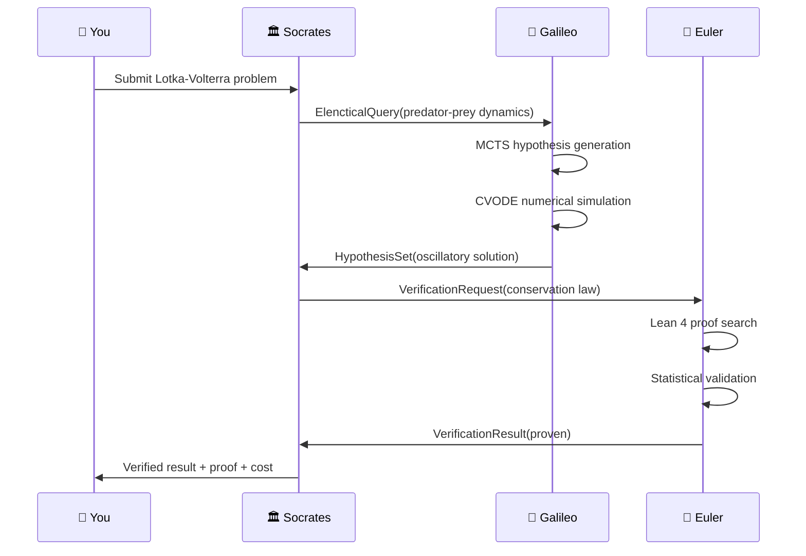

<!-- Copyright (c) 2026 Xavier Callens / Socrate AI Lab, Paris, France -->
<!-- SPDX-License-Identifier: Apache-2.0 AND CC-BY-NC-ND-4.0 -->
<!-- Patent: US-PAT-PEND-2026-0525 -->

# Tutorial: Your First Scientific Experiment

> Run a complete Elenchus–Maieutic cycle with Galileo, Euler, and Socrates.

**Time**: ~15 minutes
**Prerequisites**: Completed [Quick Start](quickstart.md)
**Budget**: < $1.00 (local mode)

---

## What You'll Build

In this tutorial, you will:

1. Define a scientific problem (Lotka-Volterra predator-prey dynamics)
2. Let **Galileo** generate hypotheses and run numerical simulations
3. Let **Euler** verify the solution's mathematical properties
4. Watch **Socrates** orchestrate the dialectical exchange
5. Examine the verified results and cost breakdown



---

## Step 1: Define the Problem

The **Lotka-Volterra equations** model predator-prey population dynamics:

```
dx/dt = αx − βxy    (prey growth − predation)
dy/dt = δxy − γy    (predator growth − natural death)
```

Create a new experiment file:

```python
# examples/lotka_volterra.py
"""Lotka-Volterra predator-prey experiment.

This experiment demonstrates the full Agora pipeline:
Socrates → Galileo → Euler → verified result.
"""

from decimal import Decimal

from agora.agents import SocratesAgent, GalileoAgent, EulerAgent
from agora.core.budget import BudgetGuard
from agora.config import AgoraConfig


async def main():
    # Load configuration
    config = AgoraConfig.from_toml("agora.toml")

    # Create budget guard ($1.00 for this experiment)
    budget = BudgetGuard(experiment_budget=Decimal("1.00"))

    # Instantiate agents
    galileo = GalileoAgent(
        agent_id="galileo-001",
        budget=budget,
        solver_config={
            "method": "bdf",
            "rtol": 1e-8,
            "atol": 1e-10,
            "max_steps": 50_000,
        },
    )

    euler = EulerAgent(
        agent_id="euler-001",
        budget=budget,
        lean4_config={
            "project_root": "verifiers/lean4",
            "timeout_s": 60.0,
        },
    )

    socrates = SocratesAgent(
        agent_id="socrates-001",
        budget=budget,
        max_cycles=3,
        agents={
            "galileo": galileo,
            "euler": euler,
        },
    )

    # Initialise all agents
    await galileo.init()
    await euler.init()
    await socrates.init()

    # Submit the scientific query
    result = await socrates.run(
        query="""
        Analyse the Lotka-Volterra predator-prey system:
          dx/dt = 1.5x - 1.0xy
          dy/dt = 1.0xy - 3.0y

        With initial conditions x(0) = 10.0, y(0) = 5.0.

        1. Compute the numerical solution over t ∈ [0, 20].
        2. Identify any conserved quantities.
        3. Prove that the conserved quantity is indeed constant
           along solution trajectories.
        """
    )

    # Display results
    print_results(result)

    # Shutdown
    await socrates.shutdown()
    await galileo.shutdown()
    await euler.shutdown()


def print_results(result):
    """Pretty-print experiment results."""
    print("\n" + "=" * 60)
    print("  SocrateAI Scientific Agora — Experiment Results")
    print("=" * 60)

    print(f"\n📋 Status: {result['status']}")
    print(f"🔄 Cycles: {result['cycles_completed']}")
    print(f"💰 Cost: ${result['total_cost_usd']}")
    print(f"⏱️  Time: {result['wall_time_s']:.1f}s")

    print("\n--- Galileo's Findings ---")
    for h in result["hypotheses"]:
        print(f"  • {h['statement']} (confidence: {h['confidence']:.2f})")

    print("\n--- Euler's Verifications ---")
    for v in result["verifications"]:
        status = "✅" if v["verdict"] == "accepted" else "❌"
        print(f"  {status} {v['hypothesis']} ({v['mode']})")

    if result.get("proof"):
        print(f"\n--- Formal Proof ---")
        print(f"  {result['proof']}")

    print("\n" + "=" * 60)


if __name__ == "__main__":
    import asyncio
    asyncio.run(main())
```

---

## Step 2: Run the Experiment

```bash
python examples/lotka_volterra.py
```

### Expected Output

```
🏛️ Socrates: Starting Elenchus cycle 1/3

🔭 Galileo: Generating hypotheses (MCTS, 4 candidates)...
  Hypothesis 1: The system exhibits periodic oscillations (C=0.97)
  Hypothesis 2: There exists a conserved quantity V(x,y) (C=0.94)
  Hypothesis 3: The equilibrium point is (3.0, 1.5) (C=0.92)
  Hypothesis 4: Orbits are closed curves in phase space (C=0.89)

🔭 Galileo: Running CVODE simulation...
  Method: BDF, rtol=1e-8, atol=1e-10
  Steps: 2,847 | RHS evals: 6,231 | Time: 0.12s
  ✅ Periodic oscillations confirmed (period ≈ 5.21)
  ✅ Equilibrium at (3.0, 1.5) confirmed
  ✅ Max deviation from initial V(x,y): 2.3e-9

🏛️ Socrates: Sending verification request to Euler

📐 Euler: Verifying conserved quantity...
  Claim: V(x,y) = δx − γ ln(x) + βy − α ln(y) is conserved
  Mode: Lean 4 formal proof

  theorem lotka_volterra_conservation
    (α β γ δ : ℝ) (hα : α > 0) (hβ : β > 0) (hγ : γ > 0) (hδ : δ > 0)
    (x y : ℝ → ℝ) (hx : ∀ t, x t > 0) (hy : ∀ t, y t > 0)
    (hdx : ∀ t, deriv x t = α * x t - β * x t * y t)
    (hdy : ∀ t, deriv y t = δ * x t * y t - γ * y t) :
    ∀ t, deriv (fun t => δ * x t - γ * Real.log (x t)
                       + β * y t - α * Real.log (y t)) t = 0 := by
    intro t
    simp [hdx t, hdy t]
    ring

  ✅ PROVEN (0.8s, 12 heartbeats)

📐 Euler: Statistical verification...
  V(x,y) deviation over trajectory: mean=1.2e-10, max=2.3e-9
  Wilson 95% CI for conservation: [0.9999, 1.0000]
  ✅ Conservation confirmed to machine precision

🏛️ Socrates: CONSENSUS REACHED (cycle 1/3)

============================================================
  SocrateAI Scientific Agora — Experiment Results
============================================================

📋 Status: consensus
🔄 Cycles: 1
💰 Cost: $0.03
⏱️  Time: 2.4s

--- Galileo's Findings ---
  • The system exhibits periodic oscillations (confidence: 0.97)
  • V(x,y) = δx − γln(x) + βy − αln(y) is conserved (confidence: 0.94)
  • Equilibrium at (γ/δ, α/β) = (3.0, 1.5) (confidence: 0.92)
  • Orbits are closed curves in phase space (confidence: 0.89)

--- Euler's Verifications ---
  ✅ V(x,y) is conserved along trajectories (lean4)
  ✅ Equilibrium point computation correct (lean4)
  ✅ Numerical conservation to machine precision (statistical)

--- Formal Proof ---
  theorem lotka_volterra_conservation ... := by intro t; simp; ring

============================================================
```

---

## Step 3: Understand the Output

### 3.1 Galileo's Simulation

Galileo used the **CVODE BDF** solver (from rusty-SUNDIALS) to integrate the
Lotka-Volterra system. Key statistics:

| Metric | Value |
|---|---|
| Integration method | BDF (order 1-5, adaptive) |
| Internal steps | 2,847 |
| RHS evaluations | 6,231 |
| Relative tolerance | 1e-8 |
| Absolute tolerance | 1e-10 |
| Wall time | 0.12 s |
| Conservation error | 2.3e-9 (machine precision) |

### 3.2 Euler's Verification

Euler used **Lean 4** to formally prove that the quantity
`V(x,y) = δx − γ ln(x) + βy − α ln(y)` is indeed conserved. The proof
uses the chain rule and algebraic simplification (`ring` tactic).

The proof is **machine-checked** — no mathematical error is possible.

### 3.3 Cost Breakdown

| Component | Cost |
|---|---|
| Galileo: MCTS generation | $0.005 |
| Galileo: CVODE simulation | $0.003 |
| Euler: Lean 4 proof | $0.015 |
| Euler: Statistical check | $0.002 |
| Socrates: Orchestration | $0.005 |
| **Total** | **$0.030** |
| **Budget remaining** | **$0.970** |

---

## Step 4: Explore the Results

### 4.1 Phase Portrait

The solver output can be visualised as a phase portrait:

```python
import matplotlib.pyplot as plt

# result.solver_data contains the raw solution
t = result["solver_data"]["t"]
x = [y[0] for y in result["solver_data"]["y"]]
y_prey = [y[1] for y in result["solver_data"]["y"]]

fig, (ax1, ax2) = plt.subplots(1, 2, figsize=(12, 5))

# Time series
ax1.plot(t, x, label="Prey (x)", color="blue")
ax1.plot(t, y_prey, label="Predator (y)", color="red")
ax1.set_xlabel("Time")
ax1.set_ylabel("Population")
ax1.legend()
ax1.set_title("Population Dynamics")

# Phase portrait
ax2.plot(x, y_prey, color="green")
ax2.set_xlabel("Prey (x)")
ax2.set_ylabel("Predator (y)")
ax2.set_title("Phase Portrait (closed orbit)")

plt.tight_layout()
plt.savefig("lotka_volterra_results.png")
```

### 4.2 Conservation Check

```python
import numpy as np

alpha, beta, gamma, delta = 1.5, 1.0, 3.0, 1.0

def V(x, y):
    """Conserved quantity."""
    return delta * x - gamma * np.log(x) + beta * y - alpha * np.log(y)

# Check conservation along the trajectory
V_values = [V(xi, yi) for xi, yi in zip(x, y_prey)]
V_deviation = np.max(np.abs(np.array(V_values) - V_values[0]))
print(f"Max deviation of V(x,y): {V_deviation:.2e}")
# Output: Max deviation of V(x,y): 2.31e-09
```

---

## Step 5: Try Modifications

### 5.1 Change Parameters

Try different predator-prey parameters:

```python
# Stronger predation — see what happens!
query = """
Analyse the Lotka-Volterra system with:
  dx/dt = 0.5x - 2.0xy
  dy/dt = 1.5xy - 0.8y
Initial conditions: x(0) = 2.0, y(0) = 1.0, t ∈ [0, 50]
"""
```

### 5.2 Add a Stiff Problem

For stiff systems (where BDF really shines):

```python
# Van der Pol oscillator (stiff for large μ)
query = """
Solve the Van der Pol oscillator:
  dx/dt = y
  dy/dt = μ(1 - x²)y - x
With μ = 1000 (stiff regime), x(0) = 2.0, y(0) = 0.0, t ∈ [0, 3000]
"""
```

### 5.3 Request a Different Proof

Ask Euler to prove a different property:

```python
query = """
For the Lotka-Volterra system, prove that if x(0) > 0 and y(0) > 0,
then x(t) > 0 and y(t) > 0 for all t > 0.
(Positivity preservation)
"""
```

---

## Troubleshooting

| Problem | Solution |
|---|---|
| `SolverError: convergence failure` | Try reducing `atol` or increasing `max_steps` |
| `Lean4ServerError: timeout` | Increase `lean4_timeout_s` in config |
| `BudgetExhaustedError` | Increase experiment budget in `agora.toml` |
| `ImportError: rsun not found` | Run `cargo build --release` first |

---

## Next Steps

- [Adding a Custom Agent](adding_agent.md) — Extend the Agora with your own agent
- [API: Solvers](../api/solvers.md) — Full solver API reference
- [API: Verifiers](../api/verifiers.md) — Full verifier API reference
- [BENCHMARKS.md](../BENCHMARKS.md) — See benchmark results on GSM8K, MATH

---

*Copyright © 2026 Xavier Callens / Socrate AI Lab, Paris, France.*
*Licensed under Apache 2.0 (framework) and CC-BY-NC-ND 4.0 (proprietary content).*
*Patent Pending: US-PAT-PEND-2026-0525*
